# FHIR IG Mermaid Diagram Catalog

> Auto-generated 2026-04-10 from [build.fhir.org](https://build.fhir.org/ig/qas.json) CI builds
> Lookback: 90 days — **96 diagrams** from **17 IGs**

### Diagram types

| Type | Count |
|------|------:|
| graph | 55 |
| sequenceDiagram | 16 |
| flowchart | 13 |
| classDiagram | 8 |
| stateDiagram-v2 | 3 |
| erDiagram | 1 |
| **Total** | **96** |

---

## smart.permission-tickets (0.1.0)

**SMART Permission Tickets**

[Build](https://build.fhir.org/ig/jmandel/smart-permission-tickets-wip/branches/spec-plan-33-glossary-data-holder) · [GitHub](https://github.com/jmandel/smart-permission-tickets-wip/tree/spec-plan-33-glossary-data-holder) · [Canonical](http://smarthealthit.org/ig/permission-tickets/ImplementationGuide/smart.permission-tickets)

FHIR 4.0.1 · 2026-04-10

### index.html — [view page](https://build.fhir.org/ig/jmandel/smart-permission-tickets-wip/branches/spec-plan-33-glossary-data-holder/index.html)

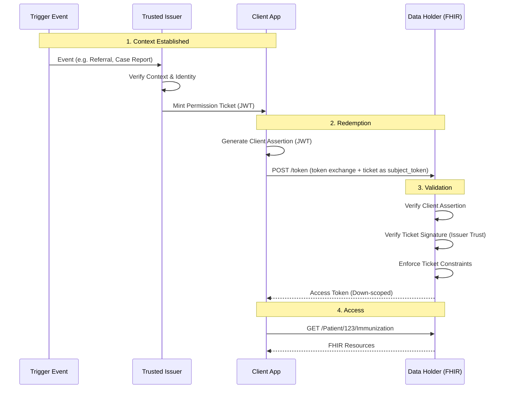

## fhir.nwgenomics.nhs.uk (0.2.2)

**NHS North West Genomics**

[Build](https://build.fhir.org/ig/nw-gmsa/nw-gmsa.github.com/branches/main) · [GitHub](https://github.com/nw-gmsa/nw-gmsa.github.com/tree/main) · [Canonical](https://fhir.nwgenomics.nhs.uk/ImplementationGuide/fhir.nwgenomics.nhs.uk)

FHIR 4.0.1 · 2026-04-10

### index.html (#1) — [view page](https://build.fhir.org/ig/nw-gmsa/nw-gmsa.github.com/branches/main/index.html)

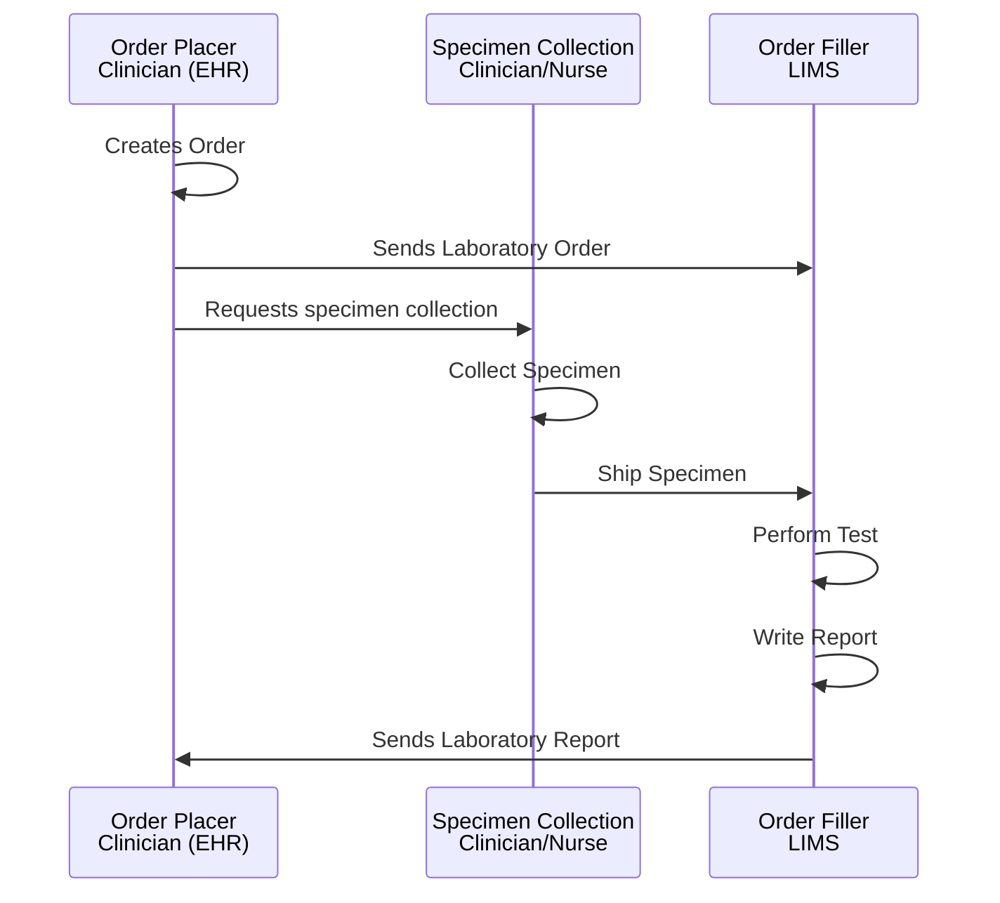

### design.html (#2) — [view page](https://build.fhir.org/ig/nw-gmsa/nw-gmsa.github.com/branches/main/design.html)

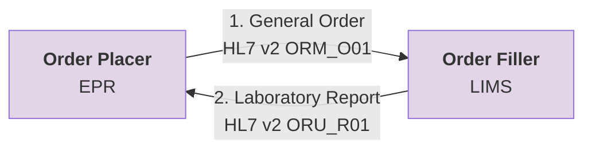

### design.html (#3) — [view page](https://build.fhir.org/ig/nw-gmsa/nw-gmsa.github.com/branches/main/design.html)

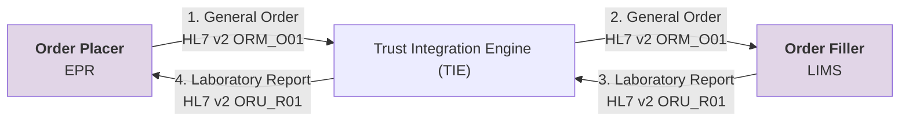

### design.html (#4) — [view page](https://build.fhir.org/ig/nw-gmsa/nw-gmsa.github.com/branches/main/design.html)

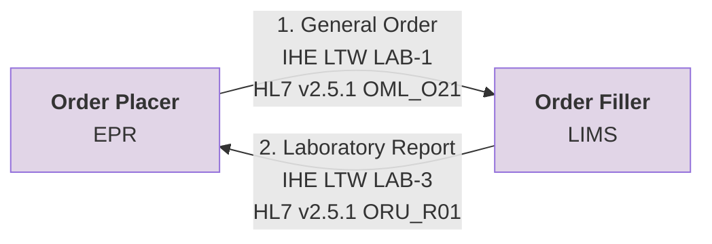

### design.html (#5) — [view page](https://build.fhir.org/ig/nw-gmsa/nw-gmsa.github.com/branches/main/design.html)

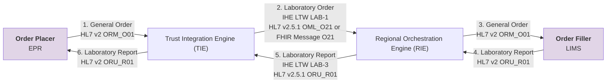

### design.html (#6) — [view page](https://build.fhir.org/ig/nw-gmsa/nw-gmsa.github.com/branches/main/design.html)

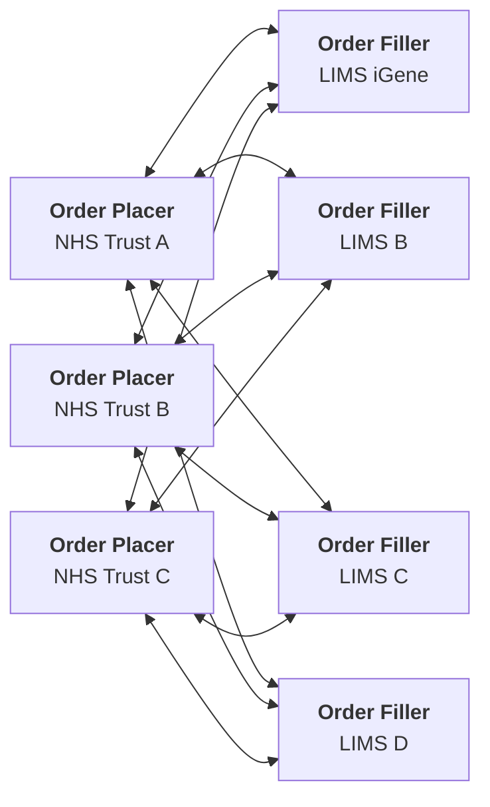

### design.html (#7) — [view page](https://build.fhir.org/ig/nw-gmsa/nw-gmsa.github.com/branches/main/design.html)

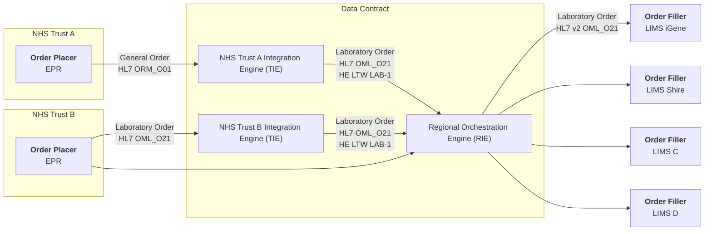

### design.html (#8) — [view page](https://build.fhir.org/ig/nw-gmsa/nw-gmsa.github.com/branches/main/design.html)

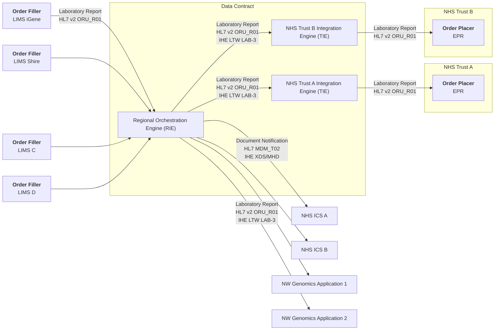

### design.html (#9) — [view page](https://build.fhir.org/ig/nw-gmsa/nw-gmsa.github.com/branches/main/design.html)

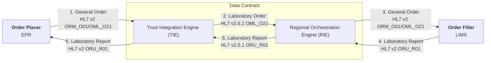

### design.html (#10) — [view page](https://build.fhir.org/ig/nw-gmsa/nw-gmsa.github.com/branches/main/design.html)

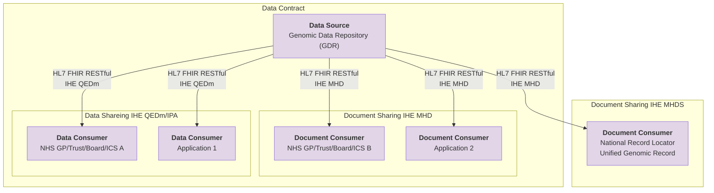

### design.html (#11) — [view page](https://build.fhir.org/ig/nw-gmsa/nw-gmsa.github.com/branches/main/design.html)

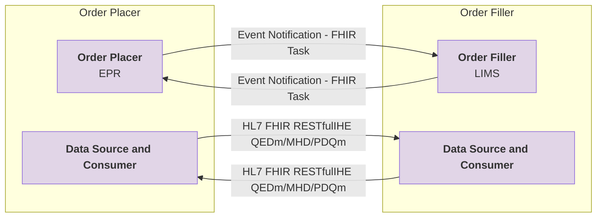

### design.html (#12) — [view page](https://build.fhir.org/ig/nw-gmsa/nw-gmsa.github.com/branches/main/design.html)

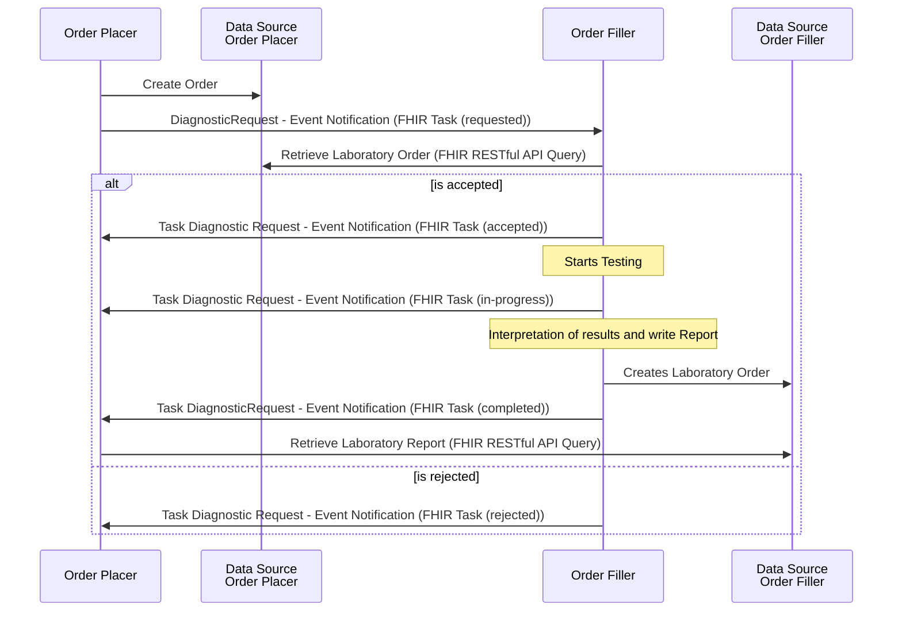

### LTW.html (#13) — [view page](https://build.fhir.org/ig/nw-gmsa/nw-gmsa.github.com/branches/main/LTW.html)

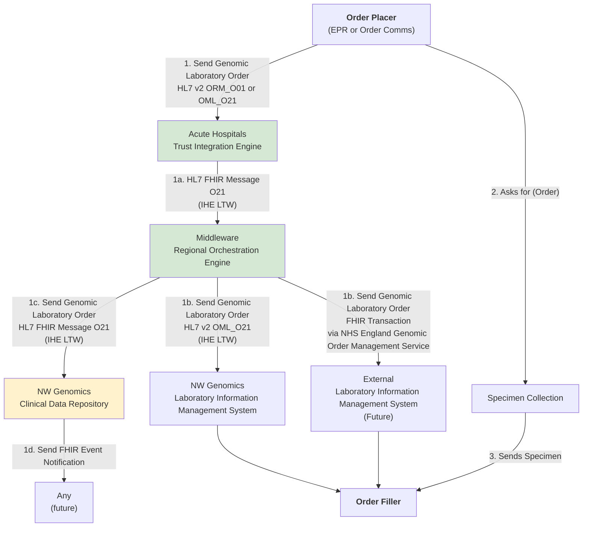

### LTW.html (#14) — [view page](https://build.fhir.org/ig/nw-gmsa/nw-gmsa.github.com/branches/main/LTW.html)

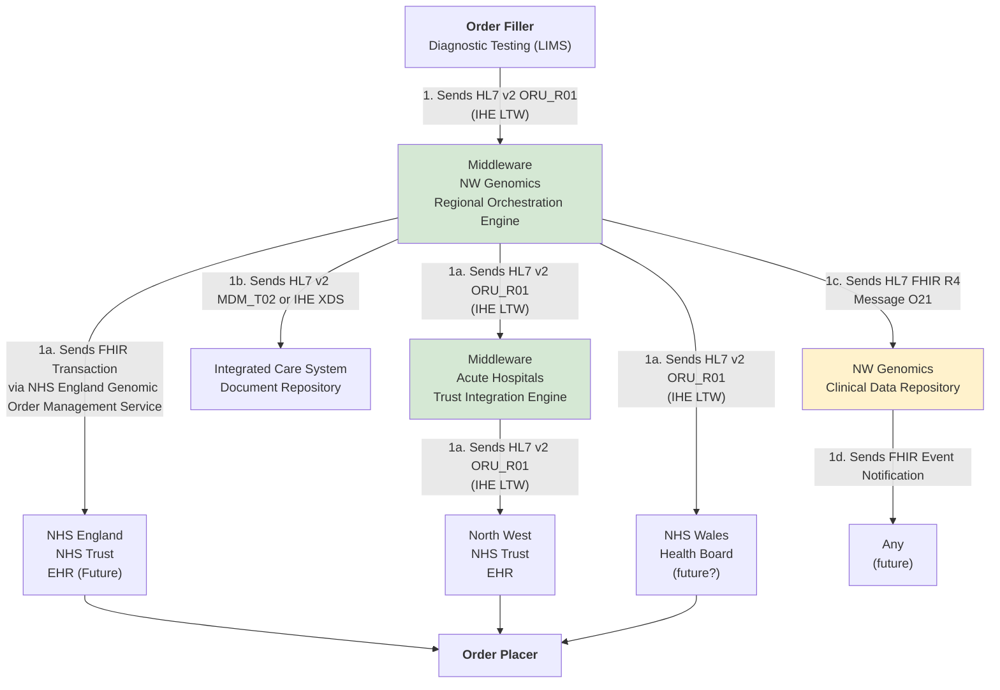

### LTW.html (#15) — [view page](https://build.fhir.org/ig/nw-gmsa/nw-gmsa.github.com/branches/main/LTW.html)

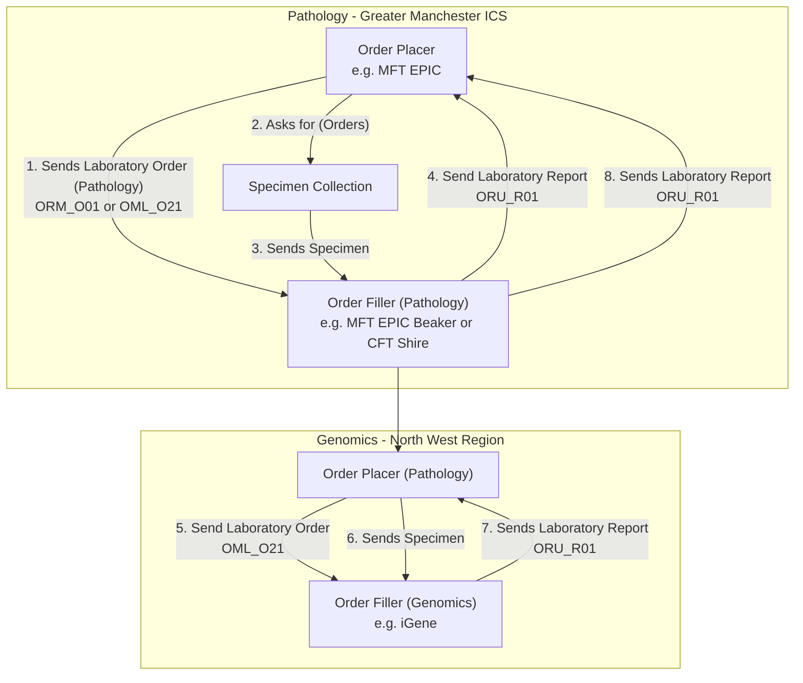

### ILW.html (#16) — [view page](https://build.fhir.org/ig/nw-gmsa/nw-gmsa.github.com/branches/main/ILW.html)

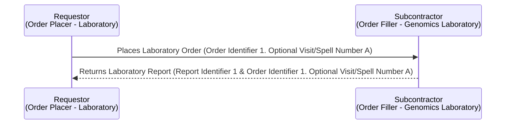

### ILW.html (#17) — [view page](https://build.fhir.org/ig/nw-gmsa/nw-gmsa.github.com/branches/main/ILW.html)

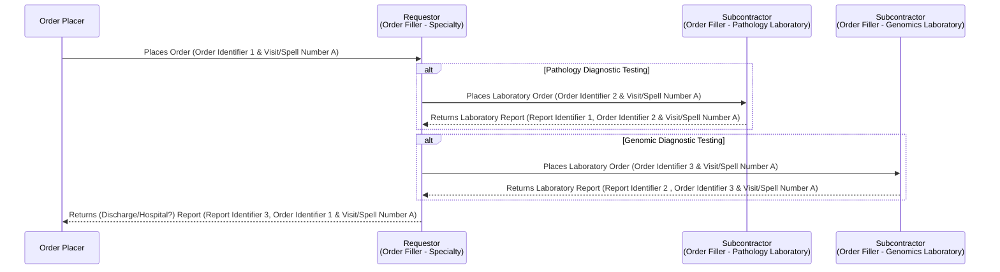

### ILW.html (#18) — [view page](https://build.fhir.org/ig/nw-gmsa/nw-gmsa.github.com/branches/main/ILW.html)

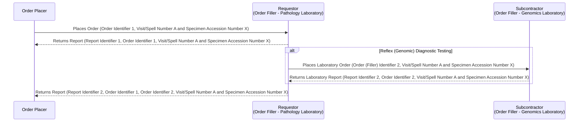

### ILW.html (#19) — [view page](https://build.fhir.org/ig/nw-gmsa/nw-gmsa.github.com/branches/main/ILW.html)

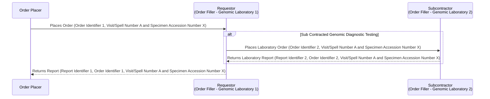

### SET.html (#20) — [view page](https://build.fhir.org/ig/nw-gmsa/nw-gmsa.github.com/branches/main/SET.html)

```mermaid
graph TD
    Home --> |1. Patient Arrives| DayUnit
    DayUnit --> |2. Performs Patient Admission| EHR
    DayUnit --> |3. Patient Sent to| Biopsy
    Biopsy --> |A. Collects Specimen| Biopsy
    Biopsy --> |4. Patient sent back to| DayUnit
    DayUnit -->  |5. Patient Discharged| Home
    Biopsy --> |B. Sends Specimen| SpecimenReception[Specimen Reception]
    SpecimenReception --> |C. Specimen Administration| LIMS[Diagnostic Testing - LIMS]
```

### SET.html (#21) — [view page](https://build.fhir.org/ig/nw-gmsa/nw-gmsa.github.com/branches/main/SET.html)

```mermaid
graph TD
    PTC["Primary Treatment Centre (PTC)"] --> |1. Sends Blood Tests Request| POSCU["Paediatric Oncology Shared Care Unit (POSCU)"]
    POSCU --> |2. Blood Collection Task| Collection["Blood Sample Taken<br/><br/>Community Nurse"] 
    Collection --> |3. Send Laboratory Order and Blood Specimen| SpecimenReception[Specimen Reception]
    SpecimenReception --> |4. Send Laboratory Order and Blood Specimen| LIMS[Diagnostic Testing - LIMS]
    LIMS --> |5. Performs Blood Test| LIMS
    LIMS --> |6. Write Laboratory Report| LIMS
    LIMS --> |7. Send Laboratory Report| POSCU
    LIMS --> |8. Send Laboratory Report| PTC
    PTC --> Prescription{Prescription Change Required?}
    Prescription --> |9. Yes| Medication[Amend Prescription]
    Medication --> |10. Inform of prescription change| POSCU
```

### HIE.html (#22) — [view page](https://build.fhir.org/ig/nw-gmsa/nw-gmsa.github.com/branches/main/HIE.html)

```mermaid
graph TD;
    Read[Consumer]-->O
    O{options} --> |"Read Genomic Laboratory Report Data <br/>FHIR REST (US Core) or bespoke API"| EHR[NHS Trust<br/>EHR] 
    O --> |"Read Genomic Laboratory Report Document<br/>FHIR REST (CareConnectAPI)<br/>or IHE XDS"| ICS[Integrated Care System <br/> Document Repository]
    O --> |"Read Genomic Laboratory Report Data <br/>FHIR REST<br/>(IHE QEDm and MHD)"| CDR[Regional Genomic<br/> Clinical Data Repository]
    
    classDef yellow fill:#FFF2CC;
    class CDR yellow;
```

### HIE.html (#23) — [view page](https://build.fhir.org/ig/nw-gmsa/nw-gmsa.github.com/branches/main/HIE.html)

```mermaid
graph TD;
    Read[Consumer]--> |Read Genomic Laboratory Order| O
    O{options} --> |"FHIR REST<br/>(IHE QEDm and MHD)"| CDR[Regional Genomic<br/> Clinical Data Repository]
    O --> |"FHIR REST (US Core) or bespoke API"| EHR[NHS Trust EPR<br/>EHR] 
    classDef yellow fill:#FFF2CC;
    class CDR yellow;
```

### HIE.html (#24) — [view page](https://build.fhir.org/ig/nw-gmsa/nw-gmsa.github.com/branches/main/HIE.html)

```mermaid
graph TD;

    LIMS[Genomics<br/>LIMS] --> |" HL7 v2 ORU_R01<br/>(IHE LTW)"| RIE[Middleware<br/>Regional Orchestration Engine];
    RIE --> |"Sends HL7 FHIR R4<br/>Message R01"| CDR[NW Genomics<br/>Clinical Data Repository]
    CDR --> |Publish Report Event| SUB[FHIR Subscription<br/>Event-Notifications]
    SUB --> |Deliver Report Event| EPR["Recipient<br/>e.g. GP Foundation System"]
    EPR --> |Get Report| CDR
   
    classDef yellow fill:#FFF2CC;
    classDef green fill:#D5E8D4;
    classDef blue fill:#DAE8FC;

    class RIE green;
    class EPR green;
    class CDR yellow;
    class SUB blue;
```

### mCSD.html (#25) — [view page](https://build.fhir.org/ig/nw-gmsa/nw-gmsa.github.com/branches/main/mCSD.html)

```mermaid
graph TD;

    U[Query Client] --> |ITI-90<br/>FHIR REST| RIE["Mobile Care Services Discovery (mCSD)"];
    RIE --> |"Organisation Data Terminology<br/>FHIR REST"| ODS["Organisation Data Service (ODS)"]
    RIE --> |"Future?"| SDS[Spine Directory Service]
    RIE --> |Future?| DOS[Directory of Service]
```

### api-security.html (#26) — [view page](https://build.fhir.org/ig/nw-gmsa/nw-gmsa.github.com/branches/main/api-security.html)

```mermaid
graph LR

consumer((Data Consumer))

subgraph APIGateway[API Gateway]
    enc[Encryption]
    rate[Rate Limiting]
    id[Identification and Authentication] 
end

subgraph DataPlatform[Data Platform]
    auth[Access Control and Authorisation]
    audit1[Audit Logging]
    consent[Patient Consent]
    data[Data Security]
    api[(Genomic Data Repository<br/>FHIR Repository)]
end

consumer --> |request| APIGateway
enc --> rate
rate --> id

APIGateway --> DataPlatform

audit1 --> auth
auth -->  data
data --> consent 
consent --> api
```

### api-security.html (#27) — [view page](https://build.fhir.org/ig/nw-gmsa/nw-gmsa.github.com/branches/main/api-security.html)

```mermaid
sequenceDiagram

participant consumer as Data Consumer
participant enc as Encryption
participant rate as Rate Limiting
participant id as Identification and Authentication 
participant auth as Access Control and Authorisation
participant audit1 as Audit Logging
participant api as FHIR Repository


consumer ->> enc: Request
enc ->> rate: Request
alt Ok
    rate ->> id: Request <br/> (authentication is a separate process)
    alt Ok 
       id ->> auth: Request 
       alt Ok
            auth ->> audit1: Request
            audit1 ->> api: Request
            api -->> audit1: Response
            audit1 -->> consumer: Response
       else Issue 
        auth -->> consumer : 403 Forbidden error
       end 
    else Issue
       id -->> consumer : 401 Unauthorized error
    end 
else Issue
    rate -->> consumer: 503 Service Unavailable error 
end
```

### api-security.html (#28) — [view page](https://build.fhir.org/ig/nw-gmsa/nw-gmsa.github.com/branches/main/api-security.html)

```mermaid
graph TD;

creator[Audit Creator]
repository[(Audit repository)]
consumer[Audit Consumer]

creator --> |"Record Audit Event [ITI-20]"| repository
consumer --> |"Retrieve ATNA Audit Event [ITI-81]"| repository
```

### api-security.html (#29) — [view page](https://build.fhir.org/ig/nw-gmsa/nw-gmsa.github.com/branches/main/api-security.html)

```mermaid
graph LR

consumer((Document Consumer))

registry["Document Registry<br/>National Record Locator (NRL)"]


SSP["Spine Security Proxy (SSP)"]

subgraph Platform 
subgraph APIGateway[API Gateway]
  PKI[Validation of PKI credentials]
end
subgraph DataPlatform[Data Platform]
    auth[Access Control and Authorisation]
    audit1[Audit Logging]
    data[Data Security]
    api[(Genomic Data Repository)]
end
end 

consumer --> |Find Patient Patient Documents| registry
consumer --> |Retrieve Document| SSP

SSP --> APIGateway
APIGateway --> DataPlatform

auth --> audit1
audit1 --> data 
data --> api
```

### exchange.html (#30) — [view page](https://build.fhir.org/ig/nw-gmsa/nw-gmsa.github.com/branches/main/exchange.html)

```mermaid
graph TD

EPR[EPR / Order Placer]
TIE["Trust Integration Engine (TIE)"]

subgraph HIE["Health Information Exchange (HIE)"]
    RIE["Regional Orchestration Engine (RIE)"]
    GDR["Genomic Data Repository (GDR)"]
   APIG["API Gateway (APIG)"]
end

subgraph APIM[API Gateway to NHS England APIM]
    PDS["Personnel Demographic Service (PDS)"]
    ODS["Organisation Terminology Service (ODS)"]
    NRL["Nationa Record Locator Service (NRL)"]
end 

LIMS[LIMS / Order Filler]
DC["Data and Document Consumer"]


EPR --> |Document Messaging| TIE
TIE --> RIE
RIE --> |Document Messaging| LIMS
RIE --> |"RESTful API (GET/PUT/POST/DELETE)"| GDR
RIE --> |Event Messaging| EPR
EPR --> |"RESTful API (GET)"| APIG
DC --> |"RESTful API (GET)"| APIG
APIG --> |"RESTful API (GET)"| GDR
RIE --> |RESTful API| APIM

classDef purple fill:#E1D5E7;
class EPR,TIE,LIMS,DC purple
```

### exchange.html (#31) — [view page](https://build.fhir.org/ig/nw-gmsa/nw-gmsa.github.com/branches/main/exchange.html)

```mermaid
graph LR;

subgraph Producer;
    s[Data Source]
    s --> v2E

    v2E["HL7 v2 Event Message"]
    s --> fEvent["FHIR Message (Event) and Subscription"]
end 

subgraph Consumer
    B[Business Logic]
    d[Data Consumer]
    B --> d
end 

v2E --> B
fEvent --> B


classDef pink fill:#F8CECC
classDef green fill:#D5E8D4;


class restC,v2E,fEvent,Agg green
```

### exchange.html (#32) — [view page](https://build.fhir.org/ig/nw-gmsa/nw-gmsa.github.com/branches/main/exchange.html)

```mermaid
graph LR;

subgraph Producer;
    s[Data Source]
    v2D["HL7 v2 Document Message"]
    s --> v2D
    s --> fMessage["FHIR Message (Document)"]
 
end 

subgraph Consumer
    B[Business Logic]
    d[Data Consumer]
    B --> d
end 

v2D --> B
fMessage --> B


classDef yellow fill:#FFF2CC;

class v2D,fMessage yellow
```

### exchange.html (#33) — [view page](https://build.fhir.org/ig/nw-gmsa/nw-gmsa.github.com/branches/main/exchange.html)

```mermaid
graph LR;

subgraph Producer;
    s[Data Source]
     s --> rest["FHIR RESTful (PUT/POST) and Transaction"]
    rB[Business Logic]

    rest --> rB
 
end 

subgraph Consumer

    d[Data Consumer]
end 

rB --> d

classDef pink fill:#F8CECC

class rest,rB pink
```

### exchange.html (#34) — [view page](https://build.fhir.org/ig/nw-gmsa/nw-gmsa.github.com/branches/main/exchange.html)

```mermaid
graph LR;

subgraph Consumer

    d[Data Consumer]
    d --> restC["FHIR RESTful (GET)"]

end 
subgraph Source;
    s[Data Source]
end 

restC --> s

classDef green fill:#D5E8D4;

class restC,v2E,fEvent,Agg green
```

### exchange.html (#35) — [view page](https://build.fhir.org/ig/nw-gmsa/nw-gmsa.github.com/branches/main/exchange.html)

```mermaid
graph LR;

subgraph Consumer

    d[Data Consumer]
    d --> restC["FHIR RESTful (GET)"]

end
subgraph Source;
s[Data Source]
Agg["FHIR Document<br/>(Aggregation Layer)"]
Agg --> s
end

restC --> Agg

classDef green fill:#D5E8D4;

class restC,v2E,fEvent,Agg green
```

### data-intro.html (#36) — [view page](https://build.fhir.org/ig/nw-gmsa/nw-gmsa.github.com/branches/main/data-intro.html)

```mermaid
---
title: Archetype, Entities and Events
---
erDiagram 
    Archetype ||--|{ Entity : hasMany
    Archetype }|--|| Event : hasMany
    Event ||--|| Entity : oftenOne2One
```

### data-intro.html (#37) — [view page](https://build.fhir.org/ig/nw-gmsa/nw-gmsa.github.com/branches/main/data-intro.html)

```mermaid
graph TD
    EHR[EPR] <--> |HL7 v2<br/>Orders & Reports| RIE
    LIMS[LIMS] <--> |HL7 v2<br/>Orders & Reports| RIE

    subgraph HIE["Health Information Exchange"]
        RIE[Regional Orchestration Engine] --> |Store<br/>HL7 FHIR| CDR[Genomic Data Repository]
    end
    Clinician[Data Sharing<br/>Clinical Apps<br/>Single Patient Record] --> |Read<br/>HL7 FHIR| CDR
    AI[Operational AI] --> |Read<br/>HL7 FHIR| CDR
    Ops["Operations Monitoring (Real Time Analytics)"] --> |Read<br/>HL7 FHIR| CDR

    CDR --> OLAP[Data Warehouse]
    A[Analytics and AI] --> OLAP
    OLAP --> FDP[Federated Data Platform]
    A --> FDP

    classDef green fill:#D5E8D4;

    class FDP,OLAP,CDR,LIMS,EHR green
```

### data-intro.html (#38) — [view page](https://build.fhir.org/ig/nw-gmsa/nw-gmsa.github.com/branches/main/data-intro.html)

```mermaid
flowchart TD
    A[Data Consumer<br/>Identifies Issue or New Constraint]
    B[Log Requirement / Issue<br/>NH Genomics IG Issues]
    C[NW Genomics Data Team<br/>Review & Feasibility Assessment]
    D["Create or Update<br/>Data Contract<br/>Implementation Guide (PR)"]
    E[NW Genomics Data Team<br/>Review & Approval]
    F[Release Change]

    A --> B --> C --> D --> E --> F
```

### Questionnaire-GenomicTestReport.html (#39) — [view page](https://build.fhir.org/ig/nw-gmsa/nw-gmsa.github.com/branches/main/Questionnaire-GenomicTestReport.html)

```mermaid
classDiagram
    class GenomicReport["Genomic Laboratory Report (result)"]
    class Variant
    class GenomicStudy["Genomic Study"]
    class DiagnosticImplication["Diagnostic Implication"]
    class TherapeuticImplication["Therapeutic Implication"]
    class GenomicStudyAnalysis["Genomic Study Analysis"]

    Variant --|> GenomicReport 
    GenomicStudy --|> GenomicReport
    GenomicStudyAnalysis --|> GenomicReport
    DiagnosticImplication --|> GenomicReport
    TherapeuticImplication ..|> GenomicReport
    Variant <|--|> DiagnosticImplication
    Variant <|..|> TherapeuticImplication
```

### testing.html (#40) — [view page](https://build.fhir.org/ig/nw-gmsa/nw-gmsa.github.com/branches/main/testing.html)

```mermaid
graph TD;
    subgraph LynchSyndrome[Lynch Syndrome Scenario]
        Nottingham((Nottingham<br/>Lyarra)) --> |Mother| Liverpool[Liverpool<br/>Ned]
        Liverpool --> |Father| Leeds[Leeds<br/>Rob]
        Liverpool --> |Father| Manchester((Manchester<br/>Sansa))
    end

    subgraph CysticFibrosis[Cystic Fibrosis Scenario]
        London((London<br/>Cersei)) --> |Mother| Birmmingham
        London --> |Mother| Wrexham((Wrexham<br/>Myrcella))
        Lancaster[Lancaster<br/>Jaime] --> |Father| Birmmingham[Birmmingham<br/>Tommen]
        Lancaster --> |Father| Wrexham
        London --> |Twin| Lancaster
    end
    
    subgraph TBD[Galactosemia Scenario]
        Warrington((Warrington<br/>Olenna)) --> |Mother| Northwich 
        Northwich[Northwich<br/>Mace] --> |Father| Congleton((Congleton<br/>Margaery))
    end
```

### architecture.html (#41) — [view page](https://build.fhir.org/ig/nw-gmsa/nw-gmsa.github.com/branches/main/architecture.html)

```mermaid
graph TD
    B[Diagnostic Report Interoperabilty] --> C{"Options <br/>Both answers<br/>are likely"}
    C -->|Event API| D{Existing Interface?}
    C -->|Data Sharing API| E{Document <br/>or Data}
    E --> |Data| Data[Structured]
    E --> |Document<br/>and hybrid| Documents["Unstructured (and Clinical) Documents"]
    Data --> REST["FHIR RESTful API<br/>IHE Query for Existing Data (QEDm)"]
    REST --> UGR[NHS England Unified Genomic Record<br/>NHS England Patient Data Manager]
    Documents --> XDS["FHIR RESTful API<br/>IHE Mobile access to Health Documents (MHD) <br/>or XML SOAP IHE XDS <br/>e.g. NHS England National Record Locator"]
    XDS --> Format{Format}
    Format --> |Binary| Binary[PDF, PMG, html, etc]
    Format --> |Structured - Imaging| RAD[DICOM]
    Format --> |Clinical Document - Laboratory| FHIRDocument["Structured and Unstructured<br/><br/>FHIR Document<br/>e.g. NHS England National Record Locator <br/> e.g. Internation Patient Summary (IPS),<br/>EU Laboratory and Imaging Reports,<br/>XPanDH/EU Hospital Discharge Report (HDR)"]  
    D --> |Yes| V2{Structured or<br/>Unstructured} 
    V2 --> |Structured| LTW[HL7 v2 ORU_R01<br/>IHE Laboratory Testing Workflow LTW LAB-3<br/>and IHE RAD]
    V2 --> |Unstructured| MDM[HL7 v2 MDM_T02 or MDM_T01 <br/> e.g. ICS/LHCRE Systems]
    MDM --> NRL["NHS England National Record Loactor Feed<br/>(POST DocumentReference)<br/>"]
    D --> |No| Workflow[FHIR Workflow <br/> e.g. NHS England Genomic Order Management Service]
    Workflow --> PubSub[FHIR Subscription]
    LTW --> Pathology[FHIR Message <br/> e.g. NHS England Pathology]
    RAD --> NIR[NHS England National Imaging Registry]

    classDef blue fill:#DAE8FC;
    classDef green fill:#D5E8D4;

    class Pathology,UGR,NIR,FHIRDocument,XDS,NRL,Workflow blue
    class LTW,REST,MDM green
```

### business-analysis.html (#42) — [view page](https://build.fhir.org/ig/nw-gmsa/nw-gmsa.github.com/branches/main/business-analysis.html)

```mermaid
graph TD;

    A[Assessment]-->|Creates Observations| B;
    A--> |Needs Diagnostic Testing and Completes| T;
    B[Diagnosis]-->|Creates Condition| C;
    T[<b>Order Placer</b><br/>Genomics Test Order]--> |"Sends Laboratory Order<br/>LAB-1 FHIR Message O21"| AN;
    T --> |Asks for| S
    S[Specimen Collection] --> |Sends Specimen| AN;
    AN["<b>Order Filler</b><br/>Diagnostic Testing"] --> |"Requests further tests <br/>(reflex order)"| T;
    AN --> |Sends Laboratory Report<br/>LAB-3 HL7 v2 ORU_R01| A;
    C[Plan]-->|Creates Goals and Tasks| D;
    D[Implement/Interventions]-->|Actions Tasks| E;
    E[Evaluate]--> |Reviews Care| A;
    
    click T Questionnaire-GenomicTestOrder.html
    click AN Questionnaire-GenomicTestReport.html
    click S ExampleScenario-BiopsyProcedure.html

    classDef purple fill:#E1D5E7;

    classDef yellow fill:#FFF2CC;
    classDef pink fill:#F8CECC
    classDef green fill:#D5E8D4;
    classDef blue fill:#DAE8FC;
    classDef orange fill:#FFE6CC;

    class A pink
    class B yellow
    class C green
    class D blue
    class E orange

    class O,S,T,AN purple
```

### business-analysis.html (#43) — [view page](https://build.fhir.org/ig/nw-gmsa/nw-gmsa.github.com/branches/main/business-analysis.html)

```mermaid
graph TD;

    subgraph NHSTrust[NHS Trust]
        T[<b>Order Placer</b><br/>EPR]--> |"1a. Sends Laboratory Order<br>LAB-1 HL7v2 ORM_O01/OML_O21"| TIE;
        TIE[Trust Integration Engine] 
        TIE--> |4c. Sends Laboratory Report<br/>LAB-3 HL7 v2 ORU_R01| T;
    end
    TIE --> |"1b. Sends Laboratory Order<br>LAB-1 FHIR Message O21"| RIE;
    T --> |2. Asks for| S
    S[Specimen Collection] --> |3. Sends Specimen| AN;
    subgraph NWGenomics[North West Genomics]
        RIE --> |"1c. Sends Laboratory Order<br>LAB-1 HL7 v2 OML_O21"| AN;
        AN["<b>Order Filler</b><br/>Diagnostic Testing<br/>LIMS iGene"] --> |4a. Sends Laboratory Report<br/>LAB-3 HL7 v2 ORU_R01| RIE;
        RIE[Regional Orchestration Engine] --> |4b. Sends Laboratory Report<br/>LAB-3 HL7 v2 ORU_R01| TIE;
    end 
    click T Questionnaire-GenomicTestOrder.html
    click AN Questionnaire-GenomicTestReport.html
    click S ExampleScenario-BiopsyProcedure.html

    classDef purple fill:#E1D5E7;

    classDef yellow fill:#FFF2CC;
    classDef pink fill:#F8CECC
    classDef green fill:#D5E8D4;
    classDef blue fill:#DAE8FC;
    classDef orange fill:#FFE6CC;

    class A pink
    class B yellow
    class C green
    class D blue
    class E orange

    class O,S,T,AN purple
```

### business-analysis.html (#44) — [view page](https://build.fhir.org/ig/nw-gmsa/nw-gmsa.github.com/branches/main/business-analysis.html)

```mermaid
graph TD

    subgraph Trust[NHS Trust]
        EPR[<b>Order Placer</b><br/>EPR]
        TIE[Trust Integration Engine]
    end 
    HODS["<b>Order Filler</b><br/>HODS<br/><b>Order Placer</b>"]
    
    EPR --> |"1. Create Laboratory Order<br/>Manual entry"| HODS
    HODS --> |"2. Send Laboratory Order (Immunology and/or Genomics) + Specimen<br/>"| MFTReception[Specimen Reception]
    MFTReception --> |"3a. (Manual) Immunology Laboratory Order + Specimen"| LIMS["<b>Order Filler</b><br/>Immunology LIMS"]
   
    subgraph Laboratory["Laboratory at NHS Trust"]
        LIMS --> |3b. Send Laboratory Report<br/>HL7 v2 ORU_R01| LIE[Laboratory<br/>Trust Integration Engine]
    end 

    LIE --> |3c. Send Laboratory Report<br/>HL7 v2 ORU_R01| HODS
    RIE --> |4d. Send Laboratory Report<br/>HL7 v2 ORU_R01| HODS
    MFTReception --> |"4a. Genomics Laboratory Order <br/> Specimen most often entered into iGene"| TestType
    
    subgraph NWGenomics[North West Genomics]
        RIE["Regional Orchestration Engine"]
    
        TestType[Test Distribution<br/>By Test Type to a LIMS] --> |4b. Tests A, B, C, etc| GLH
        GLH["<b>Order Filler</b><br/>LIMS Shire/iGene/StarLims"]
        GLH --> |4c. Send Laboratory Report<br/>HL7 v2 ORU_R01| RIE     
    end
    
    HODS --> |5. Write Consolidated Report| HODS
    HODS --> |"6. Send Consolidated Laboratory Report<br/>Email or HL7 ORU_R01"| TIE

    TIE --> |Laboratory Report| EPR 

    classDef purple fill:#E1D5E7;

    class EPR,HODS,GLH,LIMS purple
```

### business-analysis.html (#45) — [view page](https://build.fhir.org/ig/nw-gmsa/nw-gmsa.github.com/branches/main/business-analysis.html)

```mermaid
graph LR
    IGene[iGene] --> |"1. (New HL7 v2 OML_O21 feed from iGene)"| RIE[Regional Orchestration Engine] 
    RIE --> |"2. Stores a copies of orders"| CDR[Genomic Data Repository]
    StarLimsMiddleware["StarLims Middleware <br/>(May be RIE)"] --> |"3. Polls for (starlims) orders from CDR (FHIR RESTful)"| CDR
    StarLimsMiddleware --> |"4. Stores starlims order"| StarLims
    StarLimsMiddleware --> |"5. Gets Reports (poll?)"| StarLims
    StarLimsMiddleware --> |"6. Stores report"| CDR
    RIE --> |"7. Gets Reports (poll?)"| CDR
    RIE --> |"8. Distributes Reports (HL7 v2 ORU_R01)"| HODS[HODS etc]

    classDef purple fill:#E1D5E7;
    class OrderPlacer,OrderFiller purple
```

### business-analysis.html (#46) — [view page](https://build.fhir.org/ig/nw-gmsa/nw-gmsa.github.com/branches/main/business-analysis.html)

```mermaid
graph TD;
    subgraph NHSTrustA[NHS Trust]
        EPRA[<b>Order Placer</b>] --> |Asks For| SpecimenA[Sample Collection]
        EPRA --> |1a. Laboratory Order| TIE[Trust Integration Engine]
    end
 
    SpecimenA --> |2 Send Specimen| LIMSA


    TIE --> |1b. Laboratory Order<br/>LAB-1| RIE 
    subgraph NWGenomics[NW Genomics]
        RIE --> |1c. Laboratory Order<br/>LAB-1| LIMSA[<b>Order Filler</b><br/>LIMS iGene]
        
        LIMSA --> |1d. Subcontracted Laboratory Order<br/>LAB-35| LIMSB[<b>Order Filler</b><br/>LIMS Starlims]
        LIMSA --> |1d. Subcontracted Laboratory Order<br/>LAB-35| LIMSC[<b>Order Filler</b><br/>LIMS Shire]

        
        LIMSA --> |4a. Laboratory Report| RIE[Regional Orchestration Engine]
        LIMSB --> |4a. Laboratory Report| RIE
        LIMSC --> |4a. Laboratory Report| RIE

    end
    RIE --> |4b. Laboratory Report| TIE
    TIE --> |4c. Laboratory Report| EPRA
    
    classDef purple fill:#E1D5E7;
    class EPRA,SpecimenA,LIMSA,LIMSB,LIMSC purple;
```

### business-analysis.html (#47) — [view page](https://build.fhir.org/ig/nw-gmsa/nw-gmsa.github.com/branches/main/business-analysis.html)

```mermaid
graph TD;
    subgraph NHSTrust[NHS Trust]
        Practitioner[fas:fa-user-md Practitioner] --> |1. Selects Order Form| FormManager
        FormManager --> OrderEntry
        Practitioner --> |3. Completes| OrderEntry[Order Form]
        EPR[<b>Order Placer</b><br/>fas:fa-database Electronic Patient Record] --> |2. Pre Populates with existing data| OrderEntry 
        OrderEntry --> |4. Submits Order| EPR

        Practitioner --> |6. Asks for|Sample[Sample Collection]
    end
    EPR --> |5. Sends Laboratory Order<br/>LAB-1 HL7 FHIR Message O21| DiagnosticTesting[<b>Order Filler</b><br/>fas:fa-stethoscope Diagnostic Testing]
    Sample --> DiagnosticTesting
```

### business-analysis.html (#48) — [view page](https://build.fhir.org/ig/nw-gmsa/nw-gmsa.github.com/branches/main/business-analysis.html)

```mermaid
graph TD;
    Sample[Sample Collection] --> EXT
    Order --> EXT
    subgraph OrderFiller[<b>Order Filler</b> North West Genomics]
        EXT[DNA Extraction] --> SEQ[DNA Sequencing]
        SEQ --> AN[Mapping & Analysis]
        AN --> INT[Interpretation]
    end 
    INT --> |Send Laboratory Report<br/>LAB-3 HL7 v2 ORU_R01| Practitioner[<b>Order Placer</b><br/>EPR]
```

## hl7.fhir.cz.hdr (0.1.0)

**HL7 Czech Hospital Discharge Report Implementation Guide**

[Build](https://build.fhir.org/ig/HL7-cz/hdr/branches/Pavlina) · [GitHub](https://github.com/HL7-cz/hdr/tree/Pavlina) · [Canonical](https://hl7.cz/fhir/hdr/ImplementationGuide/hl7.fhir.cz.hdr)

FHIR 4.0.1 · 2026-04-10

### implementation-notes.html (#1) — [view page](https://build.fhir.org/ig/HL7-cz/hdr/branches/Pavlina/implementation-notes.html)

```mermaid
classDiagram
  direction LR
  class CZ_BundleHDR{
    <<Bundle>>
  }
  CZ_BundleHDR *-- "1" CZ_CompositionHdr
  CZ_BundleHDR *-- "1" CZ_PatientCore
  CZ_BundleHDR *-- "0..*" CZ_PractionerCore
  CZ_BundleHDR *-- "0..*" CZ_OrganizationCore
  CZ_BundleHDR *-- "0..*" CZ_EncounterHdr
  CZ_BundleHDR *-- "0..*" CZ_PractitionerRole
  CZ_BundleHDR *-- "1" CZ_ProvenanceCore
  CZ_PractitionerRole *-- "0..*" CZ_OrganizationCore
  CZ_PractitionerRole *-- "0..*" CZ_PractionerCore
  CZ_EncounterHdr *-- "1" CZ_PatientCore
  CZ_EncounterHdr *-- "1" CZ_OrganizationCore
  

  CZ_CompositionHdr --> CZ_PractitionerRole: attester[legalAuthenticator]
  CZ_CompositionHdr --> CZ_PractitionerRole: attester[resultValidator]
  CZ_CompositionHdr --> CZ_PractitionerRole: author
  CZ_CompositionHdr --> CZ_PatientCore: subject
  CZ_CompositionHdr --> CZ_EncounterHdr: period [start]
  CZ_CompositionHdr --> CZ_EncounterHdr: period [end]
  CZ_EncounterHdr --> CZ_OrganizationCore: serviceProvider
  CZ_CompositionHdr --> CZ_OrganizationCore: castodian
```

### implementation-notes-cs.html (#2) — [view page](https://build.fhir.org/ig/HL7-cz/hdr/branches/Pavlina/implementation-notes-cs.html)

```mermaid
classDiagram
  direction LR
  class CZ_BundleHDR{
    <<Bundle>>
  }
  CZ_BundleHDR *-- "1" CZ_CompositionHdr
  CZ_BundleHDR *-- "1" CZ_PatientCore
  CZ_BundleHDR *-- "0..*" CZ_PractionerCore
  CZ_BundleHDR *-- "0..*" CZ_OrganizationCore
  CZ_BundleHDR *-- "0..*" CZ_EncounterHdr
  CZ_BundleHDR *-- "0..*" CZ_PractitionerRole
  CZ_BundleHDR *-- "1" CZ_ProvenanceCore
  CZ_PractitionerRole *-- "0..*" CZ_OrganizationCore
  CZ_PractitionerRole *-- "0..*" CZ_PractionerCore
  CZ_EncounterHdr *-- "1" CZ_PatientCore
  CZ_EncounterHdr *-- "1" CZ_OrganizationCore
  

  CZ_CompositionHdr --> CZ_PractitionerRole: attester[legalAuthenticator]
  CZ_CompositionHdr --> CZ_PractitionerRole: attester[resultValidator]
  CZ_CompositionHdr --> CZ_PractitionerRole: author
  CZ_CompositionHdr --> CZ_PatientCore: subject
  CZ_CompositionHdr --> CZ_EncounterHdr: period [start]
  CZ_CompositionHdr --> CZ_EncounterHdr: period [end]
  CZ_EncounterHdr --> CZ_OrganizationCore: serviceProvider
  CZ_CompositionHdr --> CZ_OrganizationCore: castodian
```

## hl7.fhir.cz.ems (0.0.2)

**HL7 Czech EMS Implementation Guide**

[Build](https://build.fhir.org/ig/HL7-cz/cz-ems/branches/master) · [GitHub](https://github.com/HL7-cz/cz-ems/tree/master) · [Canonical](https://hl7.cz/fhir/cz-ems/ImplementationGuide/hl7.fhir.cz.ems)

FHIR 4.0.1 · 2026-04-09

### implementation-notes.html (#1) — [view page](https://build.fhir.org/ig/HL7-cz/cz-ems/branches/master/implementation-notes.html)

```mermaid
classDiagram
  direction LR
  class CZ_BundleEms{
    <<Bundle>>
  }
  CZ_BundleEms *-- "1..1" CZ_CompositionEms
  CZ_BundleEms *-- "1..1" CZ_TaskEms
  CZ_BundleEms *-- "1..*" CZ_EncounterEms
  CZ_BundleEms *-- "1..*" CZ_PatientCore
  CZ_BundleEms *-- "0..*" CZ_Coverage
  CZ_BundleEms *-- "0..*" CZ_Practioner
  CZ_BundleEms *-- "0..*" CZ_DeviceObserver
  CZ_BundleEms *-- "0..*" CZ_OrganizationCore
  CZ_BundleEms *-- "0..*" CZ_CareTeamEms
  CZ_BundleEms *-- "0..*" CZ_CarePlanEms
  CZ_BundleEms *-- "0..*" CZ_CommunicationEms
  CZ_BundleEms *-- "0..*" CZ_ConditionEms
  CZ_BundleEms *-- "0..*" CZ_AllergyIntoleranceEms
  CZ_BundleEms *-- "0..*" CZ_FamilyMemberHistoryEms
  CZ_BundleEms *-- "0..*" CZ_FlagEms
  CZ_BundleEms *-- "0..*" CZ_ImmunizationEms
  CZ_BundleEms *-- "0..*" CZ_ImmunizationRecommendationEms
  CZ_BundleEms *-- "0..*" CZ_LocationEms
  CZ_BundleEms *-- "0..*" CZ_VehicleLocationEms
  CZ_BundleEms *-- "0..*" CZ_MedicationAdministrationEms
  CZ_BundleEms *-- "0..*" CZ_ProcedureEms
  CZ_BundleEms *-- "0..*" CZ_ObservationBMIEms
  CZ_BundleEms *-- "0..*" CZ_ObservationHeightEms
  CZ_BundleEms *-- "0..*" CZ_ObservationInfectiousContactEMS
  CZ_BundleEms *-- "0..*" CZ_ObservationOtherOFEms
  CZ_BundleEms *-- "0..*" CZ_ObservationOxygenEms
  CZ_BundleEms *-- "0..*" CZ_ObservationSDOHEMS
  CZ_BundleEms *-- "0..*" CZ_ObservationTravelEms
  CZ_BundleEms *-- "0..*" CZ_ObservationVitalSignsEms
  CZ_BundleEms *-- "0..*" CZ_ObservationWeightEms
  
  CZ_TaskEms -->  CZ_CompositionEms: composition

  CZ_CompositionEms --> CZ_TaskEms: extension[basedOn]  
  CZ_CompositionEms --> CZ_EncounterEms: encounter
  CZ_CompositionEms --> CZ_Practioner: author[author]
  CZ_CompositionEms --> CZ_DeviceObserver: author[authoring-device]
  CZ_CompositionEms --> CZ_Practioner: informationRecipient[legalAuthenticator]
  CZ_CompositionEms --> CZ_OrganizationCore: custodian
  CZ_CompositionEms --> CZ_PatientCore: subject
  CZ_CompositionEms --> CZ_ObservationBMIEms: section[findings]
  CZ_CompositionEms --> CZ_ObservationHeightEms: section[findings]
  CZ_CompositionEms --> CZ_ObservationInfectiousContactEMS: section[findings]
  CZ_CompositionEms --> CZ_ObservationOtherOFEms: section[findings]
  CZ_CompositionEms --> CZ_ObservationOxygenEms: section[findings]
  CZ_CompositionEms --> CZ_ObservationSDOHEMS: section[findings]
  CZ_CompositionEms --> CZ_ObservationTravelEms: section[findings]
  CZ_CompositionEms --> CZ_ObservationVitalSignsEms: section[findings]
  CZ_CompositionEms --> CZ_ObservationWeightEms: section[findings]
  CZ_CompositionEms --> CZ_TaskEms: section[dispatch]
  CZ_CompositionEms --> CZ_LocationEms: section[dispatch]
  CZ_CompositionEms --> CZ_CommunicationEms: section[dispatch]
  CZ_CompositionEms --> CZ_VehicleLocationEms: section[dispatch]
  CZ_CompositionEms --> CZ_CareTeamEms: section[dispatch]
  CZ_CompositionEms --> CZ_Practioner: section[dispatch]
  CZ_CompositionEms --> CZ_PractionerRole: section[dispatch]
  CZ_CompositionEms --> CZ_RelatedPerson: section[dispatch]
  CZ_CompositionEms --> CZ_TaskEms: section[timeline]
  CZ_CompositionEms --> CZ_CommunicationEms: section[timeline]
  CZ_CompositionEms --> CZ_EncounterEms: section[timeline]
  CZ_CompositionEms --> CZ_ConditionEms: section[patientHx]
  CZ_CompositionEms --> CZ_MedicalDevice: section[medicalDevices]
  CZ_CompositionEms --> CZ_ProcedureEms: section[significantProcedures]
  CZ_CompositionEms --> CZ_ObservationTravelEms: section[TravelHx]
  CZ_CompositionEms --> CZ_ImmunizationEMS: section[immunizations]
  CZ_CompositionEms --> CZ_ImmunizationRecommendationEMS: section[immunizations]
  CZ_CompositionEms --> DocumentReference: section[immunizations]
  CZ_CompositionEms --> CZ_ObservationInfectiousContactEMS: section[infectiousContacts]
  CZ_CompositionEms --> CZ_FamilyMemberHistoryEms: section[familyHistory]
  CZ_CompositionEms --> CZ_ObservationSDOHEMS: section[socialHistory]
  CZ_CompositionEms --> Observation: section[alcoholUse]
  CZ_CompositionEms --> Observation: section[tobaccoUse]
  CZ_CompositionEms --> Observation: section[drugUse]
  CZ_CompositionEms --> CZ_AllergyIntoleranceEms: section[allergies]
  CZ_CompositionEms --> CZ_FlagEms: section[allergies]
  CZ_CompositionEms --> CZ_ProcedureEms: section[procedure]
  CZ_CompositionEms --> CZ_ConditionEms: section[diagnosticSummary]
  CZ_CompositionEms --> CZ_ProcedureEms: section[courseOfTreatment]
  CZ_CompositionEms --> CZ_CarePlanEms: section[recommendations]
  CZ_CompositionEms --> CZ_Coverage: section[payers]
  CZ_CompositionEms --> CZ_Attachment: section[attachments]
```

### implementation-notes-cs.html (#2) — [view page](https://build.fhir.org/ig/HL7-cz/cz-ems/branches/master/implementation-notes-cs.html)

```mermaid
classDiagram
  direction LR
  class CZ_BundleEms{
    <<Bundle>>
  }
  CZ_BundleEms *-- "1..1" CZ_CompositionEms
  CZ_BundleEms *-- "1..1" CZ_TaskEms
  CZ_BundleEms *-- "1..*" CZ_EncounterEms
  CZ_BundleEms *-- "1..*" CZ_PatientCore
  CZ_BundleEms *-- "0..*" CZ_Coverage
  CZ_BundleEms *-- "0..*" CZ_Practioner
  CZ_BundleEms *-- "0..*" CZ_DeviceObserver
  CZ_BundleEms *-- "0..*" CZ_OrganizationCore
  CZ_BundleEms *-- "0..*" CZ_CareTeamEms
  CZ_BundleEms *-- "0..*" CZ_CarePlanEms
  CZ_BundleEms *-- "0..*" CZ_CommunicationEms
  CZ_BundleEms *-- "0..*" CZ_ConditionEms
  CZ_BundleEms *-- "0..*" CZ_AllergyIntoleranceEms
  CZ_BundleEms *-- "0..*" CZ_FamilyMemberHistoryEms
  CZ_BundleEms *-- "0..*" CZ_FlagEms
  CZ_BundleEms *-- "0..*" CZ_ImmunizationEms
  CZ_BundleEms *-- "0..*" CZ_ImmunizationRecommendationEms
  CZ_BundleEms *-- "0..*" CZ_LocationEms
  CZ_BundleEms *-- "0..*" CZ_VehicleLocationEms
  CZ_BundleEms *-- "0..*" CZ_MedicationAdministrationEms
  CZ_BundleEms *-- "0..*" CZ_ProcedureEms
  CZ_BundleEms *-- "0..*" CZ_ObservationBMIEms
  CZ_BundleEms *-- "0..*" CZ_ObservationHeightEms
  CZ_BundleEms *-- "0..*" CZ_ObservationInfectiousContactEMS
  CZ_BundleEms *-- "0..*" CZ_ObservationOtherOFEms
  CZ_BundleEms *-- "0..*" CZ_ObservationOxygenEms
  CZ_BundleEms *-- "0..*" CZ_ObservationSDOHEMS
  CZ_BundleEms *-- "0..*" CZ_ObservationTravelEms
  CZ_BundleEms *-- "0..*" CZ_ObservationVitalSignsEms
  CZ_BundleEms *-- "0..*" CZ_ObservationWeightEms
  
  CZ_TaskEms --> CZ_CompositionEms: composition

  CZ_CompositionEms --> CZ_TaskEms: extension[basedOn]  
  CZ_CompositionEms --> CZ_EncounterEms: encounter
  CZ_CompositionEms --> CZ_Practioner: author[author]
  CZ_CompositionEms --> CZ_DeviceObserver: author[authoring-device]
  CZ_CompositionEms --> CZ_Practioner: informationRecipient[legalAuthenticator]
  CZ_CompositionEms --> CZ_OrganizationCore: custodian
  CZ_CompositionEms --> CZ_PatientCore: subject
  CZ_CompositionEms --> CZ_ObservationBMIEms: section[findings]
  CZ_CompositionEms --> CZ_ObservationHeightEms: section[findings]
  CZ_CompositionEms --> CZ_ObservationInfectiousContactEMS: section[findings]
  CZ_CompositionEms --> CZ_ObservationOtherOFEms: section[findings]
  CZ_CompositionEms --> CZ_ObservationOxygenEms: section[findings]
  CZ_CompositionEms --> CZ_ObservationSDOHEMS: section[findings]
  CZ_CompositionEms --> CZ_ObservationTravelEms: section[findings]
  CZ_CompositionEms --> CZ_ObservationVitalSignsEms: section[findings]
  CZ_CompositionEms --> CZ_ObservationWeightEms: section[findings]
  CZ_CompositionEms --> CZ_TaskEms: section[dispatch]
  CZ_CompositionEms --> CZ_LocationEms: section[dispatch]
  CZ_CompositionEms --> CZ_CommunicationEms: section[dispatch]
  CZ_CompositionEms --> CZ_VehicleLocationEms: section[dispatch]
  CZ_CompositionEms --> CZ_CareTeamEms: section[dispatch]
  CZ_CompositionEms --> CZ_Practioner: section[dispatch]
  CZ_CompositionEms --> CZ_PractionerRole: section[dispatch]
  CZ_CompositionEms --> CZ_RelatedPerson: section[dispatch]
  CZ_CompositionEms --> CZ_TaskEms: section[timeline]
  CZ_CompositionEms --> CZ_CommunicationEms: section[timeline]
  CZ_CompositionEms --> CZ_EncounterEms: section[timeline]
  CZ_CompositionEms --> CZ_ConditionEms: section[patientHx]
  CZ_CompositionEms --> CZ_MedicalDevice: section[medicalDevices]
  CZ_CompositionEms --> CZ_ProcedureEms: section[significantProcedures]
  CZ_CompositionEms --> CZ_ObservationTravelEms: section[TravelHx]
  CZ_CompositionEms --> CZ_ImmunizationEMS: section[immunizations]
  CZ_CompositionEms --> CZ_ImmunizationRecommendationEMS: section[immunizations]
  CZ_CompositionEms --> DocumentReference: section[immunizations]
  CZ_CompositionEms --> CZ_ObservationInfectiousContactEMS: section[infectiousContacts]
  CZ_CompositionEms --> CZ_FamilyMemberHistoryEms: section[familyHistory]
  CZ_CompositionEms --> CZ_ObservationSDOHEMS: section[socialHistory]
  CZ_CompositionEms --> Observation: section[alcoholUse]
  CZ_CompositionEms --> Observation: section[tobaccoUse]
  CZ_CompositionEms --> Observation: section[drugUse]
  CZ_CompositionEms --> CZ_AllergyIntoleranceEms: section[allergies]
  CZ_CompositionEms --> CZ_FlagEms: section[allergies]
  CZ_CompositionEms --> CZ_ProcedureEms: section[procedure]
  CZ_CompositionEms --> CZ_ConditionEms: section[diagnosticSummary]
  CZ_CompositionEms --> CZ_ProcedureEms: section[courseOfTreatment]
  CZ_CompositionEms --> CZ_CarePlanEms: section[recommendations]
  CZ_CompositionEms --> CZ_Coverage: section[payers]
  CZ_CompositionEms --> CZ_Logo: section[attachments]
```

## iknl.fhir.r4.pzp (1.0.0-rc2)

**Advance Care Planning (PZP)**

[Build](https://build.fhir.org/ig/IKNL/PZP-FHIR-R4/branches/issue137-legallycapable) · [GitHub](https://github.com/IKNL/PZP-FHIR-R4/tree/issue137-legallycapable) · [Canonical](https://api.iknl.nl/docs/pzp/r4/ImplementationGuide/iknl.fhir.r4.pzp)

FHIR 4.0.1 · 2026-04-09

### data-model.html (#1) — [view page](https://build.fhir.org/ig/IKNL/PZP-FHIR-R4/branches/issue137-legallycapable/data-model.html)

```mermaid
flowchart TB

    %% ---- Style Definitions for Categories ----
    classDef C0 fill:#e6f3ff,stroke:#b3d9ff,color:#000
    classDef C1 fill:#e6ffe6,stroke:#b3ffb3,color:#000
    classDef C2 fill:#fff5e6,stroke:#ffddb3,color:#000
    classDef C3 fill:#f0e6ff,stroke:#d9b3ff,color:#000
    classDef C4 fill:#f2f2f2,stroke:#cccccc,color:#000

    %% ---- Subgraph Definitions ----
    subgraph "CommunicationRequest"
        ACPInformRelativesRequest
    end

    subgraph "Consent"
        ACPAdvanceDirective
        ACPTreatmentDirective
    end

    subgraph "Device"
        ACPMedicalDeviceProductICD
    end

    subgraph "DeviceUseStatement"
        ACPMedicalDevice
    end

    subgraph "Encounter"
        ACPEncounter
    end

    subgraph "Goal"
        ACPMedicalPolicyGoal
    end

    subgraph "Patient"
        ACPPatient
    end

    subgraph "Practitioner"
        ACPHealthProfessionalPractitioner
    end

    subgraph "PractitionerRole"
        ACPHealthProfessionalPractitionerRole
    end

    subgraph "Procedure"
        ACPProcedure
    end

    subgraph "RelatedPerson"
        ACPContactPerson
    end

    subgraph "Observation"
        ACPOrganDonationChoiceRegistration
        ACPPositionRegardingEuthanasia
        ACPPreferredPlaceOfDeath
        ACPSenseOfPurpose
        ACPSpecificCareWishes
    end

    %% ---- Style Assignments ----
    class ACPInformRelativesRequest C2
    class ACPAdvanceDirective C0
    class ACPTreatmentDirective C0
    class ACPMedicalDeviceProductICD C2
    class ACPMedicalDevice C2
    class ACPEncounter C3
    class ACPMedicalPolicyGoal C0
    class ACPSpecificCareWishes C0
    class ACPPreferredPlaceOfDeath C0
    class ACPPositionRegardingEuthanasia C0
    class ACPOrganDonationChoiceRegistration C0
    class ACPSenseOfPurpose C0
    class ACPPatient C1
    class ACPHealthProfessionalPractitioner C1
    class ACPHealthProfessionalPractitionerRole C1
    class ACPProcedure C3
    class ACPContactPerson C1

    %% ---- Resource Type References ----
    CommunicationRequest -- "encounter" --> Encounter
    CommunicationRequest -- "sender, subject" --> Patient
    CommunicationRequest -- "requester" --> PractitionerRole
    CommunicationRequest -- "recipient" --> RelatedPerson
    Consent -- "patient, provision.actor" --> Patient
    Consent -- "provision.actor" --> PractitionerRole
    Consent -- "provision.actor" --> RelatedPerson
    DeviceUseStatement -- "device" --> Device
    DeviceUseStatement -- "subject" --> Patient
    DeviceUseStatement -- "extension" --> PractitionerRole
    Encounter -- "subject" --> Patient
    Encounter -- "participant" --> PractitionerRole
    Encounter -- "reasonReference" --> Procedure
    Encounter -- "participant" --> RelatedPerson
    Goal -- "subject" --> Patient
    Observation -- "encounter" --> Encounter
    Observation -- "subject" --> Patient
    Observation -- "performer" --> PractitionerRole
    Patient -- "contact.extension" --> RelatedPerson
    PractitionerRole -- "practitioner" --> Practitioner
    Procedure -- "encounter" --> Encounter
    Procedure -- "performer, subject" --> Patient
    Procedure -- "performer" --> PractitionerRole
    Procedure -- "performer" --> RelatedPerson
    RelatedPerson -- "patient" --> Patient
```

### data-exchange.html (#2) — [view page](https://build.fhir.org/ig/IKNL/PZP-FHIR-R4/branches/issue137-legallycapable/data-exchange.html)

```mermaid
sequenceDiagram
    autonumber
    participant C as ACP Actor Consulter<br />(Client)
    participant S as ACP Actor Provider<br />(Server)

    note over C, S: Prerequisite: client possesses access token & Patient ID

    rect rgb(240, 248, 255)
  
        par 
            %% 1. Procedures
            C->>S: GET /Procedure?patient=Patient/[id]<br />&code=sct|713603004<br />&_include=Procedure:encounter
            activate S
            S-->>C: 200 OK: Bundle (Procedure + Encounter)
            deactivate S
        and
            %% 2. Consent (TreatmentDirective)
            C->>S: GET /Consent?patient=Patient/[id]<br />&scope=http://terminology.hl7.org/CodeSystem/consentscope|treatment<br />&category=http://snomed.info/sct|129125009<br />&_include=Consent:actor
            activate S
            S-->>C: 200 OK: Bundle (Consent + PractitionerRole + RelatedPerson)
            deactivate S
        and
            %% 3. Consent (AdvanceCareDirective)
            C->>S: GET /Consent?patient=Patient/[id]<br />&scope=http://terminology.hl7.org/CodeSystem/consentscope|adr<br />&category=http://terminology.hl7.org/CodeSystem/consentcategorycodes|acd<br />&_include=Consent:actor
            activate S
            S-->>C: 200 OK: Bundle (Consent + PractitionerRole + RelatedPerson)
            deactivate S
        and
            %% 4. Goals
            C->>S: GET /Goal?patient=Patient/[id]<br />&category=http://snomed.info/sct|713603004
            activate S
            S-->>C: 200 OK: Bundle (Goal)
            deactivate S
        and
            %% 5. Observations
            C->>S: GET /Observation?patient=Patient/[id]<br />&code=http://snomed.info/sct|153851000146100,395091006,340171000146104,247751003
            activate S
            S-->>C: 200 OK: Bundle (Observation)
            deactivate S
        and
            %% 6. Devices
            C->>S: GET /DeviceUseStatement?patient=Patient/[id]<br />&device.type=http://snomed.info/sct|72506001,465460004,468542000,704707009,1263462004,1236894001<br />&_include=DeviceUseStatement:device
            activate S
            S-->>C: 200 OK: Bundle (DeviceUseStatement + Device)
            deactivate S
        and
            %% 7. CommunicationRequests
            C->>S: GET /CommunicationRequest?patient=Patient/[id]<br />&category=http://snomed.info/sct|223449006
            activate S
            S-->>C: 200 OK: Bundle (CommunicationRequest)
            deactivate S
        end
    end

    opt Resolve Additional References
        note over C: If resources contain unresolved references<br />(e.g., to Practitioner), Client performs subsequent GETs
        C->>S: GET [Reference URL]
        S-->>C: 200 OK (Referenced Resource)
    end
```

### data-exchange.html (#3) — [view page](https://build.fhir.org/ig/IKNL/PZP-FHIR-R4/branches/issue137-legallycapable/data-exchange.html)

```mermaid
sequenceDiagram
    autonumber
    participant C as ACP Actor Consulter<br>(Client)
    participant S as ACP Actor Provider<br>(Server)

    note over C, S: Prerequisite: client possesses access token & Patient ID

    rect rgb(240, 248, 255)
        
        C->>S: GET /QuestionnaireResponse?subject=Patient/[id]<br>&questionnaire=https://api.iknl.nl/docs/pzp/r4/Questionnaire/ACP-zib2020
        activate S

        S-->>C: 200 OK: Bundle (QuestionnaireResponse)

        deactivate S
    end
```

## hl7.fhir.au.ps (1.0.0-ci-build)

**AU Patient Summary Implementation Guide**

[Build](https://build.fhir.org/ig/hl7au/au-fhir-ps/branches/master) · [GitHub](https://github.com/hl7au/au-fhir-ps/tree/master) · [Canonical](http://hl7.org.au/fhir/ps/ImplementationGuide/hl7.fhir.au.ps)

FHIR 4.0.1 · 2026-04-08

### uc-interstate.html (#1) — [view page](https://build.fhir.org/ig/hl7au/au-fhir-ps/branches/master/uc-interstate.html)

```mermaid
---
config:
  theme: default
---
sequenceDiagram
  actor Attending GP as Attending GP
  participant Clinic CIS as Clinic CIS
  participant Patient Summary Host as Patient Summary Host
  Attending GP ->> Clinic CIS: Scan QR for Patient Summary access
  Clinic CIS ->> Patient Summary Host: Retrieve Patient Summary
  Attending GP ->> Clinic CIS: View Patient Summary
```

### uc-referral.html (#2) — [view page](https://build.fhir.org/ig/hl7au/au-fhir-ps/branches/master/uc-referral.html)

```mermaid
---
config:
  theme: default
---
sequenceDiagram
  participant GP CIS as GP CIS
  actor Endocrinologist as Endocrinologist
  participant Endocrinologist CIS as Endocrinologist CIS
  Endocrinologist ->> Endocrinologist CIS: Access Referral and embedded Patient Summary
  Endocrinologist CIS ->> GP CIS: Check for updates and retrieve current Patient Summary
  Endocrinologist ->> Endocrinologist CIS: View current Patient Summary
```

## fhir.nl.gf (0.3.0)

**Netherlands - Generic Functions for data exchange Implementation Guide**

[Build](https://build.fhir.org/ig/nuts-foundation/nl-generic-functions-ig/branches/add-healthcare-professional-delegation-credential) · [GitHub](https://github.com/nuts-foundation/nl-generic-functions-ig/tree/add-healthcare-professional-delegation-credential) · [Canonical](http://nuts-foundation.github.io/nl-generic-functions-ig/ImplementationGuide/fhir.nl.gf)

FHIR 4.0.1 · 2026-04-08

### credential-DeziUserCredential.html (#1) — [view page](https://build.fhir.org/ig/nuts-foundation/nl-generic-functions-ig/branches/add-healthcare-professional-delegation-credential/credential-DeziUserCredential.html)

```mermaid
graph TD
    VC[DeziUserCredential]
    VC -->|credentialSubject| HP[HealthcareProvider]
    HP -->|id| DID["did:web:za1.example"]
    HP -->|identifier| URA["87654321 (URA)"]
    HP -->|name| NAME["Zorgaanbieder"]
    HP -->|employs| HW[HealthcareWorker]
    HW -->|identifier| UZI["900000009 (UZI/Dezi-nummer)"]
    HW -->|initials| INIT["B.B."]
    HW -->|surnamePrefix| PRE["van der"]
    HW -->|surname| SUR["Jansen"]
    HW -->|role| ROLE["01.041"]
    HW -->|role_name| ROLENAME["Revalidatiearts"]
    HW -->|role_registry| ROLEREG["http://www.dezi.nl/rol_bron/big"]
```

### credential-HealthcareProfessionalDelegationCredential.html (#2) — [view page](https://build.fhir.org/ig/nuts-foundation/nl-generic-functions-ig/branches/add-healthcare-professional-delegation-credential/credential-HealthcareProfessionalDelegationCredential.html)

```mermaid
graph TD
    VC[HealthcareProfessionalDelegationCredential]
    VC -->|issuer| ISSUER["did:x509 (UZI Z-pas)"]
    VC -->|credentialSubject| HP["HealthcareProvider"]
    HP -->|id| HPID["did:web:huisarts-delinden.nl"]
    HP -->|hasDelegation| DEL["Delegation"]
    DEL -->|delegatedBy| HCP["HealthcareProfessional"]
    HCP -->|identifier| HCPID["Identifier"]
    HCPID -->|system| HCPSYS["http://fhir.nl/fhir/NamingSystem/uzi-nr-pers"]
    HCPID -->|value| HCPVAL["90001234 (UZI-nr-pers)"]
    HCP -->|roleCode| HCPROLE["01.015 (UZI rolcode)"]
    DEL -->|scope| SCOPE["DelegationScope"]
    SCOPE -->|authorizationRule| RULE["http://gis-nl.example/authorizationRule/example"]
    SCOPE -->|authorizedActions| ACTIONS["[read, write]"]
```

## elga.moped (0.1.0)

**Moderne Patient:innenabrechnung und Datenkommunikation on FHIR (MOPED)**

[Build](https://build.fhir.org/ig/HL7Austria/ELGA-MOPED-R5/branches/802-entlassen-puzzleteile) · [GitHub](https://github.com/HL7Austria/ELGA-MOPED-R5/tree/802-entlassen-puzzleteile) · [Canonical](https://elga.moped.at/ImplementationGuide/elga.moped)

FHIR 5.0.0 · 2026-04-08

### moped_konzepte.html (#1) — [view page](https://build.fhir.org/ig/HL7Austria/ELGA-MOPED-R5/branches/802-entlassen-puzzleteile/moped_konzepte.html)

```mermaid
graph TD
    Master[MasterComposition]

    subgraph Spezialisierungen
        Aufnahme[AufnahmeComposition<br />Patient & Encounter vorhanden]
        Anfrage[AnfrageComposition<br />Versicherer vorhanden]
        Antwort[AntwortComposition<br />VAEResponse vorhanden]
        Entlassungsaviso[EntlassungsAvisoComposition<br />Entlassungsdatum vorhanden]
        Entlassung[EntlassungVollstaendigComposition<br />Entlassungsdatum und Hauptdiagnose vorhanden]
        Abrechnung[AbrechnungsComposition<br />Patient Entlassen, Diagnosen und Leistungen erfasst]
        Entscheiden[EntscheidenComposition<br />]
        Siegel[SiegelComposition<br />Composition.status=final]
    end

    Master --> Aufnahme
    Master --> Anfrage
    Master --> Antwort
    Master --> Entlassung
    Master --> Abrechnung
    Master --> Entscheiden
    Master --> Siegel
```

### moped_konzepte.html (#2) — [view page](https://build.fhir.org/ig/HL7Austria/ELGA-MOPED-R5/branches/802-entlassen-puzzleteile/moped_konzepte.html)

```mermaid
graph TD
  CompV1[Composition/123/_history/1]
  CompV2[Composition/123/_history/2]
  CompV3[Composition/123/_history/3]

  Prov1[Provenance A]
  Prov2[Provenance B]
  Prov3[Provenance C]

  Prov1 --> CompV1
  Prov2 --> CompV2
  Prov3 --> CompV3
```

### actors.html (#3) — [view page](https://build.fhir.org/ig/HL7Austria/ELGA-MOPED-R5/branches/802-entlassen-puzzleteile/actors.html)

```mermaid
graph LR
    KH[Krankenanstalt]
    Moped[Moped] 
    KH --->|POST $aufnehmen| Moped 
    KH -->|POST $update| Moped
    KH -->|POST $anfragen| Moped
    KH -->|POST $entlassen| Moped
    KH -->|POST $abrechnen| Moped
    KH -->|POST $stornieren| Moped
    KH -->|POST $einmelden| Moped
    Moped -->|GET VAEResponse| KH
    Moped --->|GET ClaimResponse| KH
```

### actors.html (#4) — [view page](https://build.fhir.org/ig/HL7Austria/ELGA-MOPED-R5/branches/802-entlassen-puzzleteile/actors.html)

```mermaid
graph LR
    SV[Sozialversicherung]
    Moped[Moped] 
    Moped --->|GET VAERequest?status=active| SV
    Moped --->|GET ARKRequest?status=active| SV
    SV --->|POST $antworten| Moped
```

### actors.html (#5) — [view page](https://build.fhir.org/ig/HL7Austria/ELGA-MOPED-R5/branches/802-entlassen-puzzleteile/actors.html)

```mermaid
graph LR
    LGF[Landesgesundheitsfonds]
    Moped[Moped] 
    Moped --->|GET Claim| LGF
    Moped --->|GET QuestionnaireResponse| LGF
    LGF --->|POST $entscheiden| Moped
    LGF --->|POST $melden| Moped
```

### actors.html (#6) — [view page](https://build.fhir.org/ig/HL7Austria/ELGA-MOPED-R5/branches/802-entlassen-puzzleteile/actors.html)

```mermaid
graph LR
    BMSGPK[BMSGPK]
    Moped[Moped] 
    Moped --->|GET Composition?status=final| BMSGPK 
    Moped --->|POST Measure/$evaluate-measure| BMSGPK
```

### actors.html (#7) — [view page](https://build.fhir.org/ig/HL7Austria/ELGA-MOPED-R5/branches/802-entlassen-puzzleteile/actors.html)

```mermaid
graph LR
    Register[Register]
    Moped[Moped] 
    KH[Krankenanstalt]
    KH --->|POST $update<br />einer fallbezogenen QuestionnaireResponse| Moped 
    Moped --->|GET QuestionnaireResponse| Register
```

### workflowmanagement.html (#8) — [view page](https://build.fhir.org/ig/HL7Austria/ELGA-MOPED-R5/branches/802-entlassen-puzzleteile/workflowmanagement.html)

```mermaid
stateDiagram-v2
    [*] --> partial : $aufnehmen (initiale Composition)
    partial --> partial : $update, $anfragen, $antworten, $abrechnen, $entscheiden, etc.
    partial --> final : Freigabe durch LGF
    
    partial --> entered_in_error : $stornieren
```

### workflowmanagement.html (#9) — [view page](https://build.fhir.org/ig/HL7Austria/ELGA-MOPED-R5/branches/802-entlassen-puzzleteile/workflowmanagement.html)

```mermaid
stateDiagram-v2
    [*] --> in_progress : $aufnehmen
    in_progress --> on_hold : Beurlaubung / temporäre Unterbrechung
    on_hold --> in_progress : Rückkehr aus Beurlaubung

    in_progress --> discharged : $update 
    discharged --> completed : Hauptdiagnose dokumentiert und $entlassen

    in_progress --> entered_in_error : $stornieren
    on_hold --> entered_in_error : $stornieren
    discharged --> entered_in_error : $stornieren
```

### workflowmanagement.html (#10) — [view page](https://build.fhir.org/ig/HL7Austria/ELGA-MOPED-R5/branches/802-entlassen-puzzleteile/workflowmanagement.html)

```mermaid
stateDiagram-v2
    [*] --> active : Ressource wird eingebracht

    active --> cancelled : Stornierung durch KH
    active --> entered_in_error : Fehler erkannt
    active --> [*] : Verarbeitet
```

### AF_moped_fall_prozessuebergreifend.html (#11) — [view page](https://build.fhir.org/ig/HL7Austria/ELGA-MOPED-R5/branches/802-entlassen-puzzleteile/AF_moped_fall_prozessuebergreifend.html)

```mermaid
---
    config:
      theme: 'base'
      themeVariables:
        primaryColor: '#dbdbdb'         
        actorBorder: '#666'
        noteBkgColor: '#f4f4f4'
        noteBorderColor: '#555'
    ---
    sequenceDiagram
    autonumber
    box rgb(245, 229, 153)
    actor KH as KH (Herz Jesu Krankenhaus)
    end
    box rgb(197, 247, 186)
    participant MP as Moped
    end
    box rgb(186, 196, 247)
    actor SV as SV (ÖGK Wien)
    end
    box rgb(247, 208, 186)
    actor LGF as LGF (Landesgesundheitsfonds Wien)
    end
    box rgb(252, 179, 179) 
    actor Bund as Bund 
    end
```

## hl7.fhir.uv.aitransparency (1.0.0-ballot)

**AI Transparency on FHIR**

[Build](https://build.fhir.org/ig/HL7/aitransparency-ig/branches/main) · [GitHub](https://github.com/HL7/aitransparency-ig/tree/main) · [Canonical](http://hl7.org/fhir/uv/aitransparency/ImplementationGuide/hl7.fhir.uv.aitransparency)

FHIR 4.0.1 · 2026-03-30

### general_guidance.html (#1) — [view page](https://build.fhir.org/ig/HL7/aitransparency-ig/branches/main/general_guidance.html)

```mermaid
classDiagram
    class Resource {
        <<FHIR Resource>>
        id
        meta.security = AIAIST
        ...
    }
```

### general_guidance.html (#2) — [view page](https://build.fhir.org/ig/HL7/aitransparency-ig/branches/main/general_guidance.html)

```mermaid
classDiagram
    direction LR
    class Resource {
        <<FHIR Resource>>
        id
        meta.security = AIAIST
        ...
    }

    class Provenance {
        <<FHIR Resource>>
        target : Reference resource created/updated
        occurred : When
        reason : `AIAST`
        agent : Reference to AI Device
        agent : References to other agents involved
        entity : References to Model-Card DocumentReference
        entity : References to other data used
    }

    class Device {
        <<FHIR Resource>>
        id
        identifier
        type = "AI"
        extension : Specific kind of AI
        modelNumber
        manufacturer
        manufactureDate
        deviceName
        version
        owner
        contact
        url
        note
        safety
        extension : model-card
    }

    class DocumentReference {
        <<FHIR Resource>>
        id
        type = AImodelCard
        category = AImodelCardMarkdownFormat | AImodelCardCHAIformat
        description
        version
        data / url = codeable model-card details
        data / url = pdf rendering
    }

    Resource "1..*" <-- Provenance : "Provenance.target"
    Provenance --> Device : "Provenance.agent.who"
    Provenance --> DocumentReference : "Provenance.entity.what"
```

## hl7.fhir.uv.pocd (1.0.0)

**Point-of-Care Device Implementation Guide**

[Build](https://build.fhir.org/ig/HL7/uv-pocd/branches/version-1.1.0) · [GitHub](https://github.com/HL7/uv-pocd/tree/version-1.1.0) · [Canonical](http://hl7.org/fhir/uv/pocd/ImplementationGuide/hl7.fhir.uv.pocd)

FHIR 4.0.1 · 2026-03-27

### overview.html — [view page](https://build.fhir.org/ig/HL7/uv-pocd/branches/version-1.1.0/overview.html)

```mermaid
graph TD
    MDS["Medical Device System MDS<br/>Overall device system<br/>Device model and serial number<br/>Configuration and state"]
    
    VMD1["Virtual Medical Device VMD<br/>Logical subsystem<br/>e.g., ECG module<br/>Model and serial number"]
    VMD2["Virtual Medical Device VMD<br/>Logical subsystem<br/>e.g., SpO2 module<br/>Model and serial number"]
    VMD3["Virtual Medical Device VMD<br/>Logical subsystem<br/>e.g., Infusion pump"]
    
    CH1["Channel<br/>Logical grouping<br/>e.g., Lead II"]
    CH2["Channel<br/>Logical grouping<br/>e.g., Lead III"]
    CH3["Channel<br/>Logical grouping"]
    CH4["Channel<br/>Logical grouping<br/>e.g., Infusion line 1"]
    
    M1["Metric<br/>Measurement/Observation<br/>e.g., Heart Rate"]
    M2["Metric<br/>Waveform<br/>e.g., ECG waveform"]
    M3["Metric<br/>Measurement<br/>e.g., SpO2 %"]
    M4["Metric<br/>Measurement<br/>e.g., Pulse Rate"]
    M5["Metric<br/>Setting<br/>e.g., Infusion Rate"]
    M6["Metric<br/>State<br/>e.g., Pump status"]
    
    MDS --> VMD1
    MDS --> VMD2
    MDS --> VMD3
    
    VMD1 --> CH1
    VMD1 --> CH2
    VMD2 --> CH3
    VMD3 --> CH4
    
    CH1 --> M1
    CH1 --> M2
    CH2 --> M3
    CH3 --> M4
    CH4 --> M5
    CH4 --> M6
    
    style MDS fill:#e1f5ff,stroke:#01579b,stroke-width:3px,color:#000
    style VMD1 fill:#b3e5fc,stroke:#0277bd,stroke-width:2px,color:#000
    style VMD2 fill:#b3e5fc,stroke:#0277bd,stroke-width:2px,color:#000
    style VMD3 fill:#b3e5fc,stroke:#0277bd,stroke-width:2px,color:#000
    style CH1 fill:#81d4fa,stroke:#0288d1,stroke-width:2px,color:#000
    style CH2 fill:#81d4fa,stroke:#0288d1,stroke-width:2px,color:#000
    style CH3 fill:#81d4fa,stroke:#0288d1,stroke-width:2px,color:#000
    style CH4 fill:#81d4fa,stroke:#0288d1,stroke-width:2px,color:#000
    style M1 fill:#4fc3f7,stroke:#0297d1,color:#000
    style M2 fill:#4fc3f7,stroke:#0297d1,color:#000
    style M3 fill:#4fc3f7,stroke:#0297d1,color:#000
    style M4 fill:#4fc3f7,stroke:#0297d1,color:#000
    style M5 fill:#4fc3f7,stroke:#0297d1,color:#000
    style M6 fill:#4fc3f7,stroke:#0297d1,color:#000
```

## ch.fhir.ig.ch-umzh-connect (1.0.0-cibuild)

**CH UMZH Connect IG (R4)**

[Build](https://build.fhir.org/ig/umzhconnect/umzhconnect-ig/branches/oe_mcsd) · [GitHub](https://github.com/umzhconnect/umzhconnect-ig/tree/oe_mcsd) · [Canonical](http://fhir.ch/ig/ch-umzh-connect/ImplementationGuide/ch.fhir.ig.ch-umzh-connect)

FHIR 4.0.1 · 2026-03-24

### core-concepts.html (#1) — [view page](https://build.fhir.org/ig/umzhconnect/umzhconnect-ig/branches/oe_mcsd/core-concepts.html)

```mermaid
sequenceDiagram
    title Process flow between Placer and Fulfiller
    actor Placer
    actor Fulfiller
    activate Placer
    Placer->>Placer: Create Service Request
    deactivate Placer
    rect rgb(191, 223, 255)
    Placer->>Fulfiller: Create Task
    activate Fulfiller
    Fulfiller->>Placer: Task Response
    deactivate Fulfiller
    end
    rect rgb(191, 223, 255)
    Fulfiller->>Placer: Request Resources
    activate Placer
    Placer->>Fulfiller: Resources Response
    deactivate Placer
    end
    alt optional
        rect rgb(191, 223, 255)
        Fulfiller->>Placer: Send Notification
        end
    end
    rect rgb(191, 223, 255)
    Placer->>Fulfiller: Request Results
    activate Fulfiller
    Fulfiller->>Placer: Results Response
    deactivate Fulfiller
    end
```

### security.html (#2) — [view page](https://build.fhir.org/ig/umzhconnect/umzhconnect-ig/branches/oe_mcsd/security.html)

```mermaid
flowchart LR
    Client <-->|Client Authentication & Token Issue| AS[Authorization Server]
    Client <-->|Presents Token<br>Grants or Denies Access| RS[Resource Server]
    RS -->|Validates Token| AS
```

### security.html (#3) — [view page](https://build.fhir.org/ig/umzhconnect/umzhconnect-ig/branches/oe_mcsd/security.html)

```mermaid
sequenceDiagram
  title Referral and External Service Requests Resource Fetching Flow

  participant C as Client (Fulfiller)
  participant AS as Authorization Server
  participant AG as API Gateway (Placer)
  participant PE as Policy Engine
  participant FHIR as FHIR Server / Consent Store (Placer)

  Note over C,AS: Machine-to-machine: Client Credentials flow
  C->>AS: Token request (client auth) + requested scopes<br/>(+ consent_id context if used)
  AS-->>C: Access token (scopes + claims)<br/>(optional: includes consent_id claim, <br/>optional: sender-constrained)

  C->>AG: API request + Authorization: Bearer <token>
  AG->>AG: Validate token (sig, iss, aud, exp, scopes)<br/>(+ validate sender-constraint if FAPI)
  AG->>PE: AuthZ decision request:<br/>(client identity, requested <br/>operation/resource,<br/>consent context from token/headers)
  PE->>FHIR: Fetch/validate Consent (by consent_id)<br/>+ evaluate rules / ownership / audience
  PE->>FHIR: Evaluate whether requested resource(s)<br/>are in ServiceRequest graph referenced by consent
  PE-->>AG: Permit / Deny
  alt Permit
    AG->>FHIR: Forward request
    FHIR->>C: Response: return permitted resources<br/>(+ optional fine-grained enforcement)
  else Deny
    AG-->>C: 403 Forbidden
  end
```

### security.html (#4) — [view page](https://build.fhir.org/ig/umzhconnect/umzhconnect-ig/branches/oe_mcsd/security.html)

```mermaid
flowchart TB
    Client -->|HTTP Request| API
    API -->|grant?| PE[Policy engine]
    PE -->|Yes/No| API
    API[API gateway] --->|Route request| RS[Resource Server]
```

### usecase-referral-orthopedic.html (#5) — [view page](https://build.fhir.org/ig/umzhconnect/umzhconnect-ig/branches/oe_mcsd/usecase-referral-orthopedic.html)

```mermaid
sequenceDiagram
    title Referral - Orthopedic Surgery

    participant Placer as Placer
    participant Fulfiller as Fulfiller
    activate Placer
    Placer->>Placer: POST ServiceRequest-ReferralOrthopedicSurgery
    Placer->>Fulfiller: POST Task (basedOn/focus: ServiceRequest-ReferralOrthopedicSurgery)
    activate Fulfiller
    Fulfiller-->>Placer: created
    deactivate Placer
    deactivate Fulfiller

    Fulfiller->>Placer: GET Resources (Diagnoses, Medications, Reports)
    activate Fulfiller
    activate Placer
    Placer-->>Fulfiller: return search results (Bundle)
    deactivate Fulfiller
    deactivate Placer

    Note over Fulfiller: Request additional information<br/>(smoking status) via Questionnaire
    Fulfiller->>Fulfiller: Update Task<br/>(owner: Placer, businessStatus: awaiting-information<br/>output: QuestionnaireSmokingStatus)
    activate Fulfiller
    Fulfiller-->>Placer: Notify Task updated
    activate Placer
    Placer->>Fulfiller: GET Task
    Fulfiller-->>Placer: Return Task
    Placer->>Fulfiller: GET Questionnaire by canonical
    Fulfiller-->>Placer: Return QuestionnaireSmokingStatus
    Placer-->>Placer: Practitioner fills out Questionnaire
    Placer->>Fulfiller: POST QuestionnaireResponse
    Fulfiller-->>Placer: created
    Placer->>Fulfiller: PATCH Task (owner: Fulfiller, input: QuestionnaireResponseSmokingStatus)
    Fulfiller-->>Placer: updated
    deactivate Placer
    deactivate Fulfiller

    Fulfiller->>Fulfiller: Update Task<br/>(businessStatus: completed, output: Report)
    activate Fulfiller
    Fulfiller-->>Placer: Notify Task updated
    activate Placer
    Placer->> Fulfiller: GET Task?_id=...&_include=Task:ch-umzhconnectig-task-outputreference
    Fulfiller-->>Placer: return result (Bundle)
    deactivate Placer
    deactivate Fulfiller
```

## SHIFT-Task-Force.SLS-ValueSets (0.1.0)

**SHIFT SLS ValueSets Implementation Guide**

[Build](https://build.fhir.org/ig/SHIFT-Task-Force/SLS-ValueSets/branches/main) · [GitHub](https://github.com/SHIFT-Task-Force/SLS-ValueSets/tree/main) · [Canonical](http://SHIFT-Task-Force.github.io/SLS-ValueSets/ImplementationGuide/SHIFT-Task-Force.SLS-ValueSets)

FHIR 4.0.1 · 2026-03-04

### sls.html (#1) — [view page](https://build.fhir.org/ig/SHIFT-Task-Force/SLS-ValueSets/branches/main/sls.html)

```mermaid
graph TD
  A[DocumentReference or Bundle] --> B[Code Analysis Engine]
  B --> C{Sensitive Topic Detected?}
  C -->|Yes| D[Apply meta.security Labels]
  C -->|No| E[No Labeling Needed]

  D --> F[Updated Resource with Labels]
  F --> G[Provenance]
  G --> H[Agent: NLP Engine]
  G --> I[Entity: Original Resource]

  F --> J[AuditEvent]
  J --> K[Who/What/When/Where]
```

### ab352.html (#2) — [view page](https://build.fhir.org/ig/SHIFT-Task-Force/SLS-ValueSets/branches/main/ab352.html)

```mermaid
graph TD
    Start((Medical Record Action)) --> Destination{Destination?}

    %% IN-STATE FLOW
    Destination -->|CA Data Exchange| InState[<b>IN-STATE</b>]
    InState --> DxFGate{Specific Consent on File?}
    
    DxFGate -->|No| AutoFilter[<b>AUTO-FILTER: ENABLED</b>]
    AutoFilter -->|Action| Scrub[Scrub Sensitive Codes]
    Scrub --> SharePartial[Share General Data Only]
    
    DxFGate -->|Yes| FilterOff[<b>Follow Consent #40;AUTO-FILTER:disabled#41;</b>]
    FilterOff --> ShareFull[Share Consent Permitted Record via DxF]

    %% OUT-OF-STATE FLOW
    Destination -->|Cross Border| OutState[<b>OUT-OF-STATE</b>]
    OutState --> ShieldGate{Specific Consent on File?}
    
    ShieldGate -->|No| Block[<b>AB 352 SHIELD: BLOCKED</b>]
    Block --> Partial[Release Non-Sensitive Data Only]
    
    ShieldGate -->|Yes| Consented[<b>Follow Consent</b>]
    Consented --> Full[Release Consent Permitted Record]

    %% Formatting
    style AutoFilter fill:#fff4dd,stroke:#d4a017,stroke-width:2px
    style FilterOff fill:#9f9,stroke:#333
    style Block fill:#f99,stroke:#333
```

### ab352.html (#3) — [view page](https://build.fhir.org/ig/SHIFT-Task-Force/SLS-ValueSets/branches/main/ab352.html)

```mermaid
flowchart TD

    A["Request to access/disclose data"] --> B["PEP collects attributes"]
    B --> C["Attributes: action, sensitivity, recipient jurisdiction, purpose"]
    C --> D["PDP evaluates PolicySet urn:org:hospital:policyset:AB352"]

    D --> E1{"Action = disclose?"}
    E1 -- Yes --> F1{"Sensitivity in AB352 set?"}
    F1 -- Yes --> G1{"Recipient jurisdiction != CA?"}
    G1 -- Yes --> H1["Deny<br/>Obligation: log-denial"]
    G1 -- No --> I1["Continue evaluation<br/>(local org policies)"]
    F1 -- No --> I1

    E1 -- No --> E2{"Action = access/use?"}
    E2 -- Yes --> F2{"Recipient jurisdiction = CA<br/>AND purpose = TREATMENT?"}
    F2 -- Yes --> H2["Permit<br/>Obligation: segment-sensitive-data"]
    F2 -- No --> I2["NotApplicable or other org policies"]

    E2 -- No --> I2

    H2 --> J["PEP enforces segmentation<br/>(EHR/HIE data segregation)"]
    H1 --> K["PEP denies disclosure<br/>and records AuditEvent"]
```

### ab352.html (#4) — [view page](https://build.fhir.org/ig/SHIFT-Task-Force/SLS-ValueSets/branches/main/ab352.html)

```mermaid
graph TD
    PS["<b>PolicySet:</b> AB352 Compliance<br/>Target: CA-HOSPITAL<br/>Combining Alg: Deny-Overrides"]
    
    PS --> P1_T
    PS --> P2_T
    PS --> P3_T

    %% Policy 1
    subgraph P1 ["Policy 1: Data Disclosure Control"]
        P1_T["Target: Action = DISCLOSE"]
        P1_R1["Rule: Deny Out-of-State"]
        P1_C{"Condition:<br/>Is Sensitive Health Data?<br/>AND Recipient != CA?"}
        P1_O["Obligation: Log Denial Reason"]
        
        P1_T --> P1_R1
        P1_R1 --> P1_C
        P1_R1 --> P1_O
    end

    %% Policy 2
    subgraph P2 ["Policy 2: In-State Clinical Use"]
        P2_T["Target: Action = ACCESS/USE"]
        P2_R1["Rule: Permit Treatment"]
        P2_C{"Condition:<br/>Recipient = CA?<br/>AND Purpose = TREATMENT?"}
        
        P2_T --> P2_R1
        P2_R1 --> P2_C
    end

    %% Policy 3
    subgraph P3 ["Policy 3: Mandatory Segmentation"]
        P3_T["Target: Any"]
        P3_R1["Rule: Permit"]
        P3_O["Obligation: Trigger Segmentation Engine<br/>for Abortion/Gender Care/Contraception"]
        
        P3_T --> P3_R1
        P3_R1 --> P3_O
    end

    %% Styling
    style PS fill:#f9f,stroke:#333,stroke-width:4px
    style P1_R1 fill:#ff9999,stroke:#c00
    style P2_R1 fill:#99ff99,stroke:#0c0
    style P3_O fill:#bbdaff,stroke:#00f
```

## johnmoehrke.xacml-consent.example (0.1.0)

**John Moehrke XACML Consent Example**

[Build](https://build.fhir.org/ig/JohnMoehrke/xacml-consent/branches/main) · [GitHub](https://github.com/JohnMoehrke/xacml-consent/tree/main) · [Canonical](http://johnmoehrke.github.io/xacml-consent/ImplementationGuide/johnmoehrke.xacml-consent.example)

FHIR 4.0.1 · 2026-02-11

### generic.html (#1) — [view page](https://build.fhir.org/ig/JohnMoehrke/xacml-consent/branches/main/generic.html)

```mermaid
graph TD
    A[FHIR Consent Resource] -->|policy.uri| B[XACML Overriding Policy]
    A -->|"source[x]"| C[XACML Patient Consent Policy]
    style B fill:#ff0000,color:#fff
    style C fill:#ff0000,color:#fff
```

### ab352.html (#2) — [view page](https://build.fhir.org/ig/JohnMoehrke/xacml-consent/branches/main/ab352.html)

```mermaid
graph TD
    Start((Medical Record Action)) --> Destination{Destination?}

    %% IN-STATE FLOW
    Destination -->|CA Data Exchange| InState[<b>IN-STATE</b>]
    InState --> DxFGate{Specific Consent on File?}
    
    DxFGate -->|No| AutoFilter[<b>AUTO-FILTER: ENABLED</b>]
    AutoFilter -->|Action| Scrub[Scrub Sensitive Codes]
    Scrub --> SharePartial[Share General Data Only]
    
    DxFGate -->|Yes| FilterOff[<b>Follow Consent #40;AUTO-FILTER:disabled#41;</b>]
    FilterOff --> ShareFull[Share Consent Permitted Record via DxF]

    %% OUT-OF-STATE FLOW
    Destination -->|Cross Border| OutState[<b>OUT-OF-STATE</b>]
    OutState --> ShieldGate{Specific Consent on File?}
    
    ShieldGate -->|No| Block[<b>AB 352 SHIELD: BLOCKED</b>]
    Block --> Partial[Release Non-Sensitive Data Only]
    
    ShieldGate -->|Yes| Consented[<b>Follow Consent</b>]
    Consented --> Full[Release Consent Permitted Record]

    %% Formatting
    style AutoFilter fill:#fff4dd,stroke:#d4a017,stroke-width:2px
    style FilterOff fill:#9f9,stroke:#333
    style Block fill:#f99,stroke:#333
```

### ab352.html (#3) — [view page](https://build.fhir.org/ig/JohnMoehrke/xacml-consent/branches/main/ab352.html)

```mermaid
flowchart TD

    A["Request to access/disclose data"] --> B["PEP collects attributes"]
    B --> C["Attributes: action, sensitivity, recipient jurisdiction, purpose"]
    C --> D["PDP evaluates PolicySet urn:org:hospital:policyset:AB352"]

    D --> E1{"Action = disclose?"}
    E1 -- Yes --> F1{"Sensitivity in AB352 set?"}
    F1 -- Yes --> G1{"Recipient jurisdiction != CA?"}
    G1 -- Yes --> H1["Deny<br/>Obligation: log-denial"]
    G1 -- No --> I1["Continue evaluation<br/>(local org policies)"]
    F1 -- No --> I1

    E1 -- No --> E2{"Action = access/use?"}
    E2 -- Yes --> F2{"Recipient jurisdiction = CA<br/>AND purpose = TREATMENT?"}
    F2 -- Yes --> H2["Permit<br/>Obligation: segment-sensitive-data"]
    F2 -- No --> I2["NotApplicable or other org policies"]

    E2 -- No --> I2

    H2 --> J["PEP enforces segmentation<br/>(EHR/HIE data segregation)"]
    H1 --> K["PEP denies disclosure<br/>and records AuditEvent"]
```

### ab352.html (#4) — [view page](https://build.fhir.org/ig/JohnMoehrke/xacml-consent/branches/main/ab352.html)

```mermaid
graph TD
    PS["<b>PolicySet:</b> AB352 Compliance<br/>Target: CA-HOSPITAL<br/>Combining Alg: Deny-Overrides"]
    
    PS --> P1_T
    PS --> P2_T
    PS --> P3_T

    %% Policy 1
    subgraph P1 ["Policy 1: Data Disclosure Control"]
        P1_T["Target: Action = DISCLOSE"]
        P1_R1["Rule: Deny Out-of-State"]
        P1_C{"Condition:<br/>Is Sensitive Health Data?<br/>AND Recipient != CA?"}
        P1_O["Obligation: Log Denial Reason"]
        
        P1_T --> P1_R1
        P1_R1 --> P1_C
        P1_R1 --> P1_O
    end

    %% Policy 2
    subgraph P2 ["Policy 2: In-State Clinical Use"]
        P2_T["Target: Action = ACCESS/USE"]
        P2_R1["Rule: Permit Treatment"]
        P2_C{"Condition:<br/>Recipient = CA?<br/>AND Purpose = TREATMENT?"}
        
        P2_T --> P2_R1
        P2_R1 --> P2_C
    end

    %% Policy 3
    subgraph P3 ["Policy 3: Mandatory Segmentation"]
        P3_T["Target: Any"]
        P3_R1["Rule: Permit"]
        P3_O["Obligation: Trigger Segmentation Engine<br/>for Abortion/Gender Care/Contraception"]
        
        P3_T --> P3_R1
        P3_R1 --> P3_O
    end

    %% Styling
    style PS fill:#f9f,stroke:#333,stroke-width:4px
    style P1_R1 fill:#ff9999,stroke:#c00
    style P2_R1 fill:#99ff99,stroke:#0c0
    style P3_O fill:#bbdaff,stroke:#00f
```

## hl7.fhir.uv.howto (0.1.0)

**Guidance for FHIR IG Creation**

[Build](https://build.fhir.org/ig/FHIR/ig-guidance/branches/master) · [GitHub](https://github.com/FHIR/ig-guidance/tree/master) · [Canonical](http://hl7.org/fhir/uv/howto/ImplementationGuide/hl7.fhir.uv.howto)

FHIR 5.0.0 · 2026-02-01

### diagrams-mermaid.html — [view page](https://build.fhir.org/ig/FHIR/ig-guidance/branches/master/diagrams-mermaid.html)

```mermaid
graph TD;
    A-->B;
    A-->C;
    B-->D;
    C-->D;
```

## ch.fhir.ig.ch-epr-fhir (5.0.0)

**CH EPR FHIR (R4)**

[Build](https://build.fhir.org/ig/ehealthsuisse/ch-epr-fhir/branches/master) · [GitHub](https://github.com/ehealthsuisse/ch-epr-fhir/tree/master) · [Canonical](http://fhir.ch/ig/ch-epr-fhir/ImplementationGuide/ch.fhir.ig.ch-epr-fhir)

FHIR 4.0.1 · 2026-01-30

### iti-mhd.html (#1) — [view page](https://build.fhir.org/ig/ehealthsuisse/ch-epr-fhir/branches/master/iti-mhd.html)

```mermaid
%%{
    init: {
        'theme': 'neutral',
        'themeVariables': {
           'fontSize': '14px'
        }
    }
}%%
flowchart LR
    A[Document Consumer] -->|Query| B(Document Responder
    Option Federated Cross Community Access
    Grouped with Document Consumer)
    B --> C(Document Responder own community)
    B --> D(Document Responders federated communities)
```

### iti-mhd.html (#2) — [view page](https://build.fhir.org/ig/ehealthsuisse/ch-epr-fhir/branches/master/iti-mhd.html)

```mermaid
%%{
    init: {
        'theme': 'neutral',
        'themeVariables': {
            'fontSize': '14px'
        }
    }
}%%
flowchart LR
    A[Document Consumer] -->|Retrieve| B(Document Responder
    Option Federated Cross Community Access
    Grouped with Document Consumer)
    B --> C{own community?}
    C -->|yes| D(Document Responder own community)
    C -->|no| E(Document Responder federated community)
```

### iti-mhd.html (#3) — [view page](https://build.fhir.org/ig/ehealthsuisse/ch-epr-fhir/branches/master/iti-mhd.html)

```mermaid
%%{
    init: {
        'theme': 'neutral',
        'themeVariables': {
            'fontSize': '14px'
        }
    }
}%%
flowchart LR
    A[Document Source] -->|Update Doc Metadata| B(Document Responder
    Option Federated Cross Community Access
    Grouped with Document Source)
    B --> C{own Community?}
    C -->|yes| D(Document Responder own community)
    C -->|no| E(Document Responder federated community)
```

### iti-67.html (#4) — [view page](https://build.fhir.org/ig/ehealthsuisse/ch-epr-fhir/branches/master/iti-67.html)

```mermaid
%%{
    init: {
        'theme': 'neutral',
        'themeVariables': {
           'fontSize': '14px'
        }
    }
}%%
flowchart LR
    A[Document Consumer] -->|Query| B(Document Responder
    Option Federated Cross Community Access
    Grouped with Document Consumer)
    B --> C(Document Responder own community)
    B --> D(Document Responders federated communities)
```

### iti-68.html (#5) — [view page](https://build.fhir.org/ig/ehealthsuisse/ch-epr-fhir/branches/master/iti-68.html)

```mermaid
%%{
    init: {
        'theme': 'neutral',
        'themeVariables': {
            'fontSize': '14px'
        }
    }
}%%
flowchart LR
    A[Document Consumer] -->|Retrieve| B(Document Responder
    Option Federated Cross Community Access
    Grouped with Document Consumer)
    B --> C{own community?}
    C -->|yes| D(Document Responder own community)
    C -->|no| E(Document Responder federated community)
```

### ch-mhd-1.html (#6) — [view page](https://build.fhir.org/ig/ehealthsuisse/ch-epr-fhir/branches/master/ch-mhd-1.html)

```mermaid
%%{
    init: {
        'theme': 'neutral',
        'themeVariables': {
            'fontSize': '14px'
        }
    }
}%%
flowchart LR
    A[Document Source] -->|Update Doc Metadata| B(Document Responder
    Option Federated Cross Community Access
    Grouped with Document Source)
    B --> C{own Community?}
    C -->|yes| D(Document Responder own community)
    C -->|no| E(Document Responder federated community)
```

## hl7.fhir.cl.minsal.r2bo (0.2.0-draft)

**Repositorio de Reportes de Biopsias Oncológicas**

[Build](https://build.fhir.org/ig/Minsal-CL/R2BO/branches/master) · [GitHub](https://github.com/Minsal-CL/R2BO/tree/master) · [Canonical](https://interoperabilidad.minsal.cl/fhir/ig/r2bo/ImplementationGuide/hl7.fhir.cl.minsal.r2bo)

FHIR 4.0.1 · 2026-01-27

### design-consideration.html — [view page](https://build.fhir.org/ig/Minsal-CL/R2BO/branches/master/design-consideration.html)

```mermaid
classDiagram
    class ApDiagnosticReport
    class ApComposition 
    ApDiagnosticReport --> ApComposition: extension[composition]
    ApComposition --> ApDiagnosticReport: extension[diagnosticReport-reference]
```

## example.fhir.ph.roadsafety (0.3.0)

**DRAFT PH Road Safety Implementation Guide**

[Build](https://build.fhir.org/ig/UPM-NTHC/PH-RoadSafetyIG/branches/cron-schedule) · [GitHub](https://github.com/UPM-NTHC/PH-RoadSafetyIG/tree/cron-schedule) · [Canonical](https://build.fhir.org/ig/UPM-NTHC/PH-RoadSafetyIG/ImplementationGuide/example.fhir.ph.roadsafety)

FHIR 4.0.1 · 2026-01-22

### data-modelling.html — [view page](https://build.fhir.org/ig/UPM-NTHC/PH-RoadSafetyIG/branches/cron-schedule/data-modelling.html)

```mermaid
flowchart LR
  Patient[Patient]
  Encounter[Encounter]
  Observation[Observation]
  Condition[Condition]
  Procedure[Procedure]
  DocumentReference[DocumentReference]
  Location[Location]
  Organization[Organization]

  Patient -->|subject of| Encounter
  Encounter -->|has observations| Observation
  Encounter -->|has diagnoses| Condition
  Encounter -->|has procedures| Procedure
  Encounter -->|serviceProvider| Organization
  Encounter -->|occursAt| Location
  Observation -->|derivedFrom| DocumentReference
  DocumentReference -->|attachment for| Encounter

  style Patient fill:#f9f,stroke:#333,stroke-width:1px
  style Observation fill:#ff9,stroke:#333,stroke-width:1px
```

